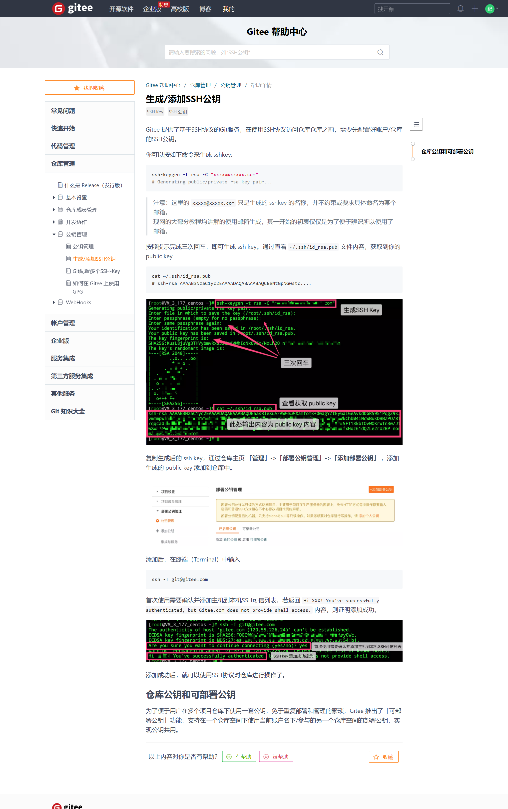

### 1.Git单人开发

```
git remote add origin git地址(添加远程仓库)
git remote -v(检查)
git remote remove origin(删除远程仓库s)
git push -u(记住本次推送的信息) origin master
git push origin master

$ git init
Initialized empty Git repository in C:/Users/阔乐c/Desktop/product/.git/
repository仓库

$ git config -l
查看当前git的配置

$ git config user.name "FENG"
在配置当中新增一个userName
$ git config user.email "2657359449@qq.com"
在配置当中新增一个userEmail
//必须

修改全局用户名和地址
git config --global user.name "your name"
git config --global user.email "your email"
git 修改当前的project的用户名的命令为：git config user.name 你的目标用户名;
git 修改当前的project提交邮箱的命令为：git config user.email 你的目标邮箱名;

git status

$ git add index.js  添加到暂缓区

$ git commit -m "初始化项目 添加index.js"
提交文件到master分支

$ git diff index.js
查看最近一次对文件的修改

修改后要将文件重新提交到暂缓区，重新提交到master分支


git log index.js
查看对单个文件的修改历史
git log /get reflog
查看对整个项目文件的修改历史

$ git reset --hard HEAD^
恢复到上一个版本
$ git reset --hard 7b23163
恢复到指定版本

$ touch .gitignore
创建忽略配置文件
	在.gitignore中写
	*.css 忽略所有的css文件


单人流程:
    一、准备工作(只做一次):
    1.创建一个工作区
	2.在工作区中的打开git终端
	3.通过git init指令, 初始化版本库
	4.通过git config user.name "姓名"
	      git config user.email "邮箱"
	  设置用户名和邮箱(不设置要挨骂)
	5.通过git config -l查看设置情况
	二、开发阶段(反复执行)
	1.编写代码
	2.通过"git add 文件名称"/"git add ." 添加到版本库的暂缓区中
	3.通过git commit -m"说明" 将暂缓区的文件添加到HEAD指针指向的分支中
	(默认只有一个分支, master分支, 也称之为主分支)
	注意点:
	1.不是写一句代码就add commit一次, 应该是完成一个功能后再add commit
	2.commit时-m注释一定要认真编写, 与当前提交内容保持一致, 否则要挨骂

单人使用Git管理项目好处:
    1.可以通过git status查看哪些文件没有被管理, 修改了哪些文件
      红色(没有被管理或者被修改了)、绿色(在暂缓区)
    2.可以通过 git diff查看具体修改了哪些代码
    3.可以通过git log / git reflog查看项目演变历史
	4.可以通过git reset --hard 版本号  在任意版本之间切换
	5.无需备份多个文件, 每次commit提交Git会自动备份


Git强制提交本地分支覆盖远程分支

git push origin 分支名 --force
例子：

cd 代码目录
git push origin master --force
 

Git远程服务器覆盖本地版本

git fetch --all
git reset --hard origin/master

```


### 2.Git多人开发

```
git init --bare

git clone 远程服务器共享版本库地址

git push提交到远程版本库(git commit -m是提交到本地版本库)

git pull


$ git status
On branch master
Your branch is based on 'origin/master', but the upstream is gone.
  (use "git branch --unset-upstream" to fixup)
git branch --unset-upstream

多人开发:
一、在远程服务器上创建一个共享版本库
    1.项目负责人打开远程的服务器, 然后创建一个工作区
    2.在远程的服务器上打开工作区, 在工作区中打开Git终端工具
    3.在Git终端工具中输入 git init --bare
    4.经过以上几步, 就代表远程服务器上的共享版本库已经创建好了
二、开发人员下载远程版本库
    1.开发人员在自己的电脑上打开Git终端工具
    2.从远程的服务器上下载当前项目的共享版本库  git clone 远程服务器共享版本库地址
      和单人开发使用Git的区别: 单人开发是自己创建版本库, 而多人开发是从远程服务器下载版本库
三、进入开发阶段
    和单人开发一样
    1.设置用户名和邮箱
    2.编写代码
    3.git add .添加到暂缓区
    4.git commit -m 添加到HEADER指针指向的分支
    5.注意点:
    commit是将编写好的代码提交到本地的版本库, 所以其它的开发人员是拿不到我们提交的代码的
    如果想让其它开发人员也能拿到我们提交的代码, 还必须将编写好的代码提交到远程的服务器

    多人开发特有
    6.将代码提交到远程的服务器 git push
    7.其它的开发人员只需要通过 git pull 就可以拿到更新的代码了

多人开发使用Git注意点:
    1.不能将不能运行的代码提交到本地和远程服务器(切记一定不能)
    2.如果服务器上有其它开发人员的更新内容, 那么我们不能直接通过push将我们的代码提交到服务器
      如果服务器上有其它开发人员更新的内容, 我们必须先将其它开发人员更新的内容更新到本地之后才能通过push提交我们的内容
    3.如何我们更新的内容和其它同事更新的内容有冲突(修改了同一个文件的同一行代码), 这个时候需要我们自己手动修改冲突, 修改完冲突之后才能将代码提交到远程服务器

    开发技巧:
    只要开发完了一个功能就要立即提交代码, 因为在企业开发中谁后提交谁就负责解决冲突, 谁的工作量就会变大
```

### 3.Git多人分支的使用

```
git branch     查看当前版本库中有多少个分支

git branch   分支名称     创建分支

git switch 分支名称       切换分支

git merge 分支名称       来合并分支

git branch -d 分支名称    来删除本地的分支

git push origin --delete 分支名称     来删除远程服务器的分支


一、如何查看有多少个分支?
    1.通过git branch指令就可以查看当前版本库中有多少个分支
    注意点:
    1.如果当前的版本库是空的, 那么无法查看
    2.如果通过git branch指令查看当前版本库中有多少个分支, 输出的内容中哪一个分支前面有*号
    就代表当前的HEADER指针指向哪一个分支, 我们提交的代码就会提交到指向的分支中

二、如何创建一个分支
    1.通过git branch 分支名称 来创建一个新的分支
    注意点:
    在哪个分支中创建了新的分支, (那么创建出来的新的分支就会继承当前分支的所有状态)
    例如:
    在master分支中做了两个操作, 然后在master分支中创建了Dev分支
    那么创建出来的Dev分支就会继承master分支中的这两个操作
    注意点:
    (一旦分支被创建出来之后, 分支就是独立的, 分支之间不会相互影响)

三、如何切换分支?
    1.通过git switch 分支名称 来修改HEADER指针的指向
    注意点: 只要HEADER指针的指向发生了改变, 那么commit的代码就会发生改变
    HEADER指针指向谁commit提交的代码就提交到谁里面

四、如何将分支提交到远程服务器
    1.通过git branch -r 来查看远程服务器上有多少个分支
    2.首先需要在本地切换到新建的分支中, 然后通过git push指令提交新建的分支到远程的服务器
    git push --set-upstream origin Dev

五、如何合并分支
    可以通过 git merge 分支名称 来合并分支
    例如:
    在master分支中执行  git merge Dev 就代表需要将Dev分支中的代码都合并到master分支中
    例如:
    在Dev分支中执行 git merge master 就代表需要将master分支中的代码都合并到Dev分支中

六、如何删除分支
    1.可以通过git branch -d 分支名称 来删除本地的分支
    2.可以通过git push origin --delete 分支名称 来删除远程服务器的分支

```

### 4.Gitflow工作流程

```javascript
$ git tag -a v0.1 -m "初始化项目"    创建标记

$ git tag 查看标记

$ git push origin v1.0 
项目经理提交远程标记

$ git show v0.1
查看版本更新日志

就像写代码需要代码规范一样，代码管理同样需要一个清晰的流程和规范
https://nvie.com/posts/a-successful-git-branching-model/

一、准备阶段
    1.初始化远程工作区和共享版本库
    git init --bare

    2.项目经理初始化项目, 并在master定制标记
    添加初始化文件
    git add .
    git commit -m
    git push
    git tag v0.1
    git push origin v0.1

    3.项目经理基于master分支创建develop分支
    git switch master
    git branch Develop
    git switch Develop
    git push

    4.项目经理给开发人员分配工作任务

二、开发阶段
    1.开发人员基于develop分支创建功能分支
    git branch feature/home
    git switch feature/login

    2.开发人员在自己的分支上add commit push

    3.开发完成告诉项目经理, 由项目经理审核代码并合并代码到develop
    git pull
    git switch feature/home  检查代码
    git switch Develop
    git merge feature/home
    git switch feature/login  检查代码
    git switch Develop
    git merge feature/login

三、准备上线阶段
    1.项目经理基于develop分支创建release分支
    git switch Develop
    git branch Release/v1.0

    2.测试人员获取release分支代码进行测试

    3.发现bug由开发人员基于release分支创建bugfix分支进行修复
    git pull
    git switch Release/v1.0
    git branch bugfix/issue32
    修复bug / add / commit

    4.修复完成后重新合并到release分支
    git switch Release/v1.0
    git merge bugfix/issue32
    git push

    5.将测试和修复完所有bug的最终代码合并到master分支和develop分支
    git switch Develop
    git merge Release/v1.0
    git switch master
    git merge Release/v1.0

四、项目上线
    1.项目经理在master分支定制标记
    git switch master
    git tag -a v1.0 -m"项目第一次上线"
    2.项目经理项目经理将标记提交到远程服务器
    git push origin v1.0

五、上线之后
    1.项目上线后发现紧急bug
    2.基于master分支创建hotfix分支, 在该分支上修复bug
    git switch master
    git branch hotfix/issue66
    修复bug / add / commit

    3.修复完成后重新合并到master分支和develop分支
    git switch Develop
    git merge hotfix/issue66

    4.项目经理重新在master分支定制标记
    git switch master
    git merge hotfix/issue66
    git tag v1.1
    git push origin v1.1


- master主分支:
    + 负责记录上线版本的迭代，该分支代码与线上代码是完全一致的。
- develop开发分支:
    + 该分支记录相对稳定的版本，所有的feature分支都从该分支创建
- feature/* 特性（功能）分支:
    + 用于开发新的功能，不同的功能创建不同的功能分支，功能分支开发完成并自测通过之后，需要合并到 develop 分支。
- release/*发布分支：
    + 用于代码上线准备，该分支从develop分支创建，创建之后由测试发布到测试环境进行测试，测试过程中发现bug需要开发人员在该release分支上进行bug修复，所有bug修复完后，在上线之前，需要合并该release分支到master分支和develop分支。
- bugfix/* bug修复分支:
    + 用于修复不紧急的bug，普通bug均需要创建bugfix分支开发，开发完成自测没问题后合并到 develop 分支后，删除该分支。
- hotfix/*紧急bug修复分支：
    + 该分支只有在紧急情况下使用，从master分支创建，用于紧急修复线上bug，修复完成后，需要合并该分支到master分支以便上线，同时需要再合并到develop分支。


    https://gitee.com/help/articles/4181
```

 [Gitflow.pptx](Git.assets\Gitflow.pptx) 

### 5.Github使用 

```javascript
$ git clone https://github.com/nolimits4web/swiper.git


```


