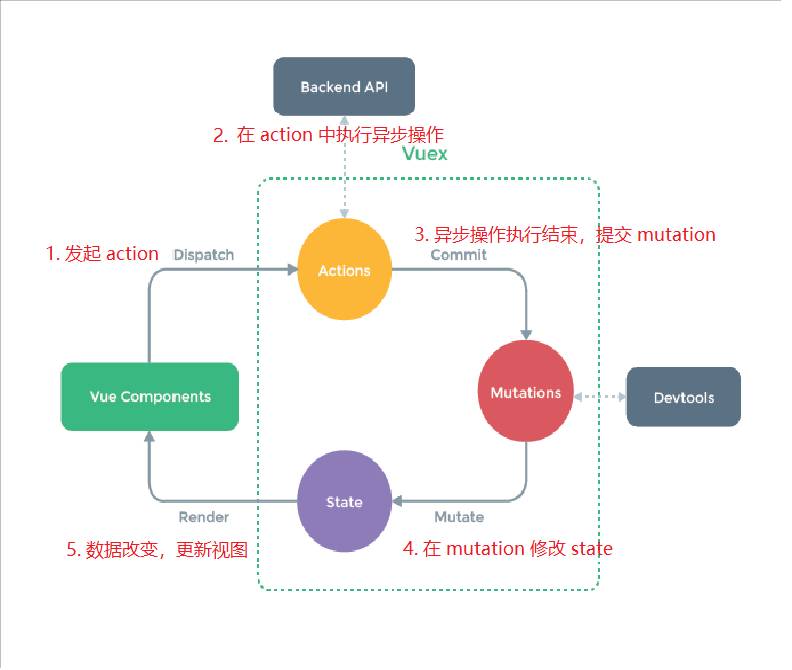
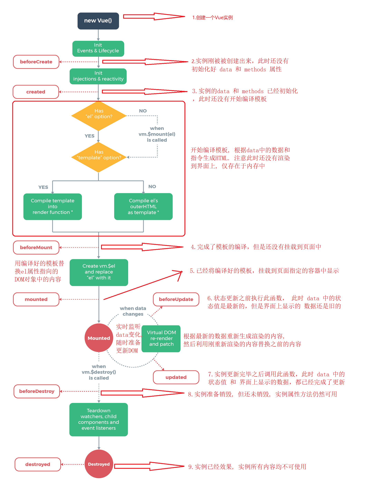

### 1.vue模板
接口请求一般放在 mounted 中，但需要注意的是服务端渲染时不支持 mounted， 需要放到 created 中。
```javascript
<!DOCTYPE html>
<html lang="en">
<head>
    <meta charset="UTF-8">
    <meta name="viewport" content="width=device-width, initial-scale=1.0">
    <title>Document</title>
    <script src="js/vue.js"></script>
</head>
<body>
    <div id="app">
        <p>{{name}}</p>
    </div>
<script>
    //创建vue实例对象
    let vue=new Vue({
        //告诉vue的实例对象，将来需要控制界面上的哪一个区域
        el:'#app',
        //告诉vue实例对象，被控制的区域的数据是什么
        data:{
            name:"纪树锋",

        }
    });
    

</script>

</body>
</html>
```

### 2.vue数据单向传递

```javascript
<body>
<!--
1.MVVM设计模式
在MVVM设计模式中由3个部分组成
M : Model      数据模型(保存数据, 处理数据业务逻辑)
V : View       视图(展示数据, 与用户交互)
VM: View Model 数据模型和视图的桥梁(M是中国人, V是美国人, VM就是翻译)

MVVM设计模式最大的特点就是支持数据的双向传递
数据可以从 M -> VM -> V
也可以从   V -> VM -> M

2.Vue中MVVM的划分
Vue其实是基于MVVM设计模式的
被控制的区域: View
Vue实例对象 : View Model
实例对象中的data: Model

3.Vue中数据的单向传递
我们把"数据"交给"Vue实例对象", "Vue实例对象"将数据交给"界面"
      Model  ->  View Model                       ->   View
-->
<!--这里就是MVVM中的View-->
<div id="app">
    <p>{{ name }}</p>
</div>
<script>
    // 这里就是MVVM中的View Model
    let vue = new Vue({
        el: '#app',
        // 这里就是MVVM中的Model
        data: {
            name: "李南江"
        }
    });
</script>
</body>
```

### 3.vue数据双向传递

```javascript
<!DOCTYPE html>
<html lang="en">
<head>
    <meta charset="UTF-8">
    <title>04-Vue数据双向传递</title>
    <script src="js/vue.js"></script>
</head>
<body>
<!--
1.Vue调试工具安装
如果你能打开谷歌插件商店, 直接在线安装即可
https://chrome.google.com/webstore/detail/vuejs-devtools/nhdogjmejiglipccpnnnanhbledajbpd?hl=zh-CN

由于国内无法打开谷歌国外插件商店, 所以可以离线安装
https://www.chromefor.com/vue-js-devtools_v5-3-0/

2.安装步骤:
2.1下载离线安装包
2.2打开谷歌插件界面
2.3直接将插件拖入
2.4报错 程序包无效: "CRX_HEADER_INVALID"
   可以将安装包修改为rar后缀, 解压之后再安装
2.5重启浏览器
-->
<!--
2.数据双向绑定
默认情况下Vue只支持数据单向传递 M -> VM -> V
但是由于Vue是基于MVVM设计模式的, 所以也提供了双向传递的能力
在<input>、<textarea> 及 <select> 元素上可以用 v-model 指令创建双向数据绑定

注意点: v-model 会忽略所有表单元素的 value、checked、selected 特性的初始值
<input v-model="message" placeholder="edit me" /> 
而总是将 Vue 实例的数据作为数据来源
-->

<!--这里就是MVVM中的View-->
<div id="app">
    <p>{{ name }}</p>
    <input type="text" v-model="msg">
</div>
<script>
    // 这里就是MVVM中的View Model
    let vue = new Vue({
        el: '#app',
        // 这里就是MVVM中的Model
        data: {
            name: "李南江",
            msg: "知播渔"
        }
    });
</script>
</body>
</html>
```

### 4.v-once

```javascript
<!DOCTYPE html>
<html lang="en">
<head>
    <meta charset="UTF-8">
    <title>05-常用指令-v-once</title>
    <script src="js/vue.js"></script>
</head>
<body>
<!--
1.什么是指令?
指令就是Vue内部提供的一些自定义属性,
这些属性中封装好了Vue内部实现的一些功能
只要使用这些指令就可以使用Vue中实现的这些功能

2.Vue数据绑定的特点
只要数据发生变化, 界面就会跟着变化

3.v-once指令:
让界面不要跟着数据变化, 只渲染一次
-->

<!--这里就是MVVM中的View-->
<div id="app">
    <p v-once>原始数据: {{ name }}</p>
    <p>当前数据: {{ name }}</p>
</div>
<script>
    // 这里就是MVVM中的View Model
    let vue = new Vue({
        el: '#app',
        // 这里就是MVVM中的Model
        data: {
            name: "李南江",
        }
    });
</script>
</body>
</html>
```

### 5.v-cloak

```javascript
<!DOCTYPE html>
<html lang="en">
<head>
    <meta charset="UTF-8">
    <title>06-常用指令-v-cloak</title>
    <style>
        [v-cloak] { display: none }
		注意这里！！！
    </style>
</head>
<body>
<!--
1.Vue数据绑定过程
1.1会先将未绑定数据的界面展示给用户
1.2然后再根据模型中的数据和控制的区域生成绑定数据之后的HTML代码
1.3最后再将绑定数据之后的HTML渲染到界面上

正是在最终的HTML被生成渲染之前会先显示模板内容
所以如果用户网络比较慢或者网页性能比较差, 那么用户会看到模板内容

2.如何解决这个问题
利用v-cloak配合 [v-cloak]:{display: none}默认先隐藏未渲染的界面
等到生成HTML渲染之后再重新显示

3.v-cloak指令作用:
数据渲染之后自动显示元素
-->

<!--这里就是MVVM中的View-->
<div id="app">
    <p v-cloak>{{ name }}</p>
</div>
<!--
<div id="app">
    <p> 李南江 </p>
</div>
-->
<script src="js/vue.js"></script>
<script>
    // 这里就是MVVM中的View Model
    let vue = new Vue({
        el: '#app',
        // 这里就是MVVM中的Model
        data: {
            name: "李南江",
        }
    });
</script>
</body>
</html>
```

### 6.v-text和v-html

```javascript
<!DOCTYPE html>
<html lang="en">
<head>
    <meta charset="UTF-8">
    <title>07-常用指令v-text和v-html</title>
    <script src="js/vue.js"></script>
</head>
<body>
<!--
1.什么是v-text指令
v-text就相当于过去学习的innerText

2.什么是v-html指令
v-html就相当于过去学习的innerHTML
-->

<!--这里就是MVVM中的View-->
<div id="app">
    <!--插值的方式: 可以将指定的数据插入到指定的位置-->
<!--    <p>++++{{ name }}++++</p>-->
    <!--插值的方式: 不会解析HTML-->
<!--    <p>++++{{ msg }}++++</p>-->
    <!--v-text的方式: 会覆盖原有的内容-->
<!--    <p v-text="name">++++++++</p>-->
    <!--v-text的方式: 也不会解析HTML-->
<!--    <p v-text="msg">++++++++</p>-->
    <!--v-html的方式: 会覆盖原有的内容-->
    <p v-html="name">++++++++</p>
    <!--v-html的方式:会解析HTML-->
    <p v-html="msg">++++++++</p>
</div>
<script>
    // 这里就是MVVM中的View Model
    let vue = new Vue({
        el: '#app',
        // 这里就是MVVM中的Model
        data: {
            name: "李南江",
            msg: "<span>我是span</span>"
        }
    });
</script>
</body>
</html>
```

### 7.v-if

```javascript
<!DOCTYPE html>
<html lang="en">
<head>
    <meta charset="UTF-8">
    <title>08-常用指令v-if</title>
    <script src="js/vue.js"></script>
</head>
<body>
<!--
1.什么是v-if指令
条件渲染: 如果v-if取值是true就渲染元素, 如果不是就不渲染元素

2.v-if特点:
如果条件不满足根本就不会创建这个元素(重点)

3.v-if注意点
v-if可以从模型中获取数据
v-if也可以直接赋值一个表达式
-->
<!--
4.v-else指令
v-else指令可以和v-if指令配合使用, 当v-if不满足条件时就执行v-else就显示v-else中的内容

5.v-else注意点
v-else不能单独出现
v-if和v-else中间不能出现其它内容
-->
<!--
6.v-else-if指令
v-else-if可以和v-if指令配合使用, 当v-if不满足条件时就依次执行后续v-else-if, 哪个满足就显示哪个

7.v-else-if注意点
和v-else一样
-->

<!--这里就是MVVM中的View-->
<div id="app">
<!--    <p v-if="show">我是true</p>-->
<!--    <p v-if="hidden">我是false</p>-->
<!--    <p v-if="true">我是true</p>-->
<!--    <p v-if="false">我是false</p>-->
<!--    <p v-if="age >= 18">我是true</p>-->
<!--    <p v-if="age < 18">我是false</p>-->

<!--    <p v-if="age >= 18">成年人</p>-->
<!--    <p>中间的内容</p>-->
<!--    <p v-else>未成年人</p>-->

    <p v-if="score >= 80">优秀</p>
    <p v-else-if="score >= 60">良好</p>
    <p v-else>差</p>
</div>
<script>
    // 这里就是MVVM中的View Model
    let vue = new Vue({
        el: '#app',
        // 这里就是MVVM中的Model
        data: {
            show: true,
            hidden: false,
            age: 17,
            score: 50
        }
    });
</script>
</body>
</html>
```

### 8.v-show

```javascript
<!DOCTYPE html>
<html lang="en">
<head>
    <meta charset="UTF-8">
    <title>09-常用指令v-show</title>
    <script src="js/vue.js"></script>
</head>
<body>
<!--
1.什么是v-show指令
v-show和v-if的能够一样都是条件渲染, 取值为true就显示, 取值为false就不显示

2.v-if和v-show区别
v-if: 只要取值为false就不会创建元素
v-show: 哪怕取值为false也会创建元素, 只是如果取值是false会设置元素的display为none（注意）

3.v-if和v-show应用场景
由于取值为false时v-if不会创建元素, 所以如果需要切换元素的显示和隐藏, 每次v-if都会创建和删除元素
由于取值为false时v-show会创建元素并设置display为none, 所有如果需要切换元素的显示和隐藏,
不会反复创建和删除, 只是修改display的值
所以: 如果企业开发中需要频繁切换元素显示隐藏, 那么推荐使用v-show（v-show大法好）,否则使用v-if
-->

<!--这里就是MVVM中的View-->
<div id="app">
<!--    <p v-show="show">我是true</p>-->
<!--    <p v-show="hidden">我是false</p>-->
<!--    <p v-show="true">我是true</p>-->
<!--    <p v-show="false">我是false</p>-->
<!--    <p v-show="age >= 18">我是true</p>-->
<!--    <p v-show="age < 18">我是false</p>-->
    <p v-show="show">我是段落1</p>
    <p v-show="hidden">我是段落2</p>
</div>
<script>
    // 这里就是MVVM中的View Model
    let vue = new Vue({
        el: '#app',
        // 这里就是MVVM中的Model
        data: {
            show: true,
            hidden: false,
            age: 18
        }
    });
</script>
</body>
</html>
```

### 9.v-for

```javascript
<!DOCTYPE html>
<html lang="en">
<head>
    <meta charset="UTF-8">
    <title>10-常用指令v-for</title>
    <script src="js/vue.js"></script>
</head>
<body>
<!--
1.什么是v-for指令
相当于JS中的for in循环, 可以根据数据多次渲染元素

2.v-for特点
可以遍历 数组, 字符, 数字, 对象
-->

<!--这里就是MVVM中的View-->
<div id="app">
    <ul>
<!--        <li v-for="(value, index) in list">{{index}}-&#45;&#45;{{value}}</li>-->
<!--        <li v-for="(value, index) in 'abcdefg'">{{index}}-&#45;&#45;{{value}}</li>-->
<!--        <li v-for="(value, index) in 6">{{index}}-&#45;&#45;{{value}}</li>-->
        <li v-for="(value, key) in obj">{{key}}---{{value}}</li>
    </ul>
</div>
<script>
    // 这里就是MVVM中的View Model
    let vue = new Vue({
        el: '#app',
        // 这里就是MVVM中的Model
        data: {
            list: ["张三", "李四", "王五", "赵六"],
            obj: {
                name: "lnj",
                age: 33,
                gender: "man",
                class: "知播渔"
            }
        }
    });
</script>
</body>
</html>
```

### 10.v-bind

```javascript
<!DOCTYPE html>
<html lang="en">
<head>
    <meta charset="UTF-8">
    <title>10-常用指令v-bind</title>
    <script src="js/vue.js"></script>
</head>
<body>
<!--
1.什么是v-bind指令
在企业开发中想要给"元素"绑定数据, 我们可以使用{{}}, v-text, v-html
但是如果想给"元素的属性"绑定数据, 就必须使用v-bind
所以v-bind的作用是专门用于给"元素的属性"绑定数据的

2.v-bind格式
v-bind:属性名称="绑定的数据"
:属性名称="绑定的数据"

3.v-bind特点
赋值的数据可以是任意一个合法的JS表达式
例如: :属性名称="age + 1"
-->

<!--这里就是MVVM中的View-->
<div id="app">
<!--    <p>{{name}}</p>-->
<!--    <p v-text="name"></p>-->
<!--    <p v-html="name"></p>-->
    <!--注意点: 如果要给元素的属性绑定数据, 那么是不能够使用插值语法的-->
<!--    <input type="text" value="{{name}}">-->
    <!--注意点: 虽然通过v-model可以将数据绑定到input标签的value属性上
                但是v-model是有局限性的, v-model只能用于input/textarea/select
                但是在企业开发中我们还可能需要给其它标签的属性绑定数据-->
<!--    <input type="text" v-model="name">-->
<!--    <input type="text" v-bind:value="name">-->
<!--    <input type="text" :value="name">-->
    <input type="text" :value="age + 1">
</div>
<script>
    // 这里就是MVVM中的View Model
    let vue = new Vue({
        el: '#app',
        // 这里就是MVVM中的Model
        data: {
            name: "知播渔666",
            age: 18
        }
    });
</script>
</body>
</html>
```

### 11.常用指令-绑定类名

```javascript
<!DOCTYPE html>
<html lang="en">
<head>
    <meta charset="UTF-8">
    <title>12-常用指令-绑定类名</title>
    <script src="js/vue.js"></script>
    <style>
        *{
            margin: 0;
            padding: 0;
        }
        .size{
            font-size: 100px;
        }
        .color{
            color: red;
        }
        .active{
            background: skyblue;
        }
    </style>
</head>
<body>
<!--
1.v-bind指令的作用
v-bind指令给"任意标签"的"任意属性"绑定数据
对于大部分的属性而言我们只需要直接赋值即可, 例如:value="name"
但是对于class和style属性而言, 它的格式比较特殊

2.通过v-bind绑定类名格式
:class="['需要绑定类名', ...]"

3.注意点:
3.1直接赋值一个类名(没有放到数组中)默认回去Model中查找
:class="需要绑定类名"
2.2数组中的类名没有用引号括起来也会去Model中查找
:class="[需要绑定类名]"
2.3数组的每一个元素都可以是一个三目运算符按需导入
:class="[flag?'active':'']"
2.4可以使用对象来替代数组中的三目运算符按需导入
:class="[{'active': true}]"
<div v-bind:class="{ active: isActive }"></div>
2.5绑定的类名太多可以将类名封装到Model中
obj: {
    'color': true,
    'size': true,
    'active': false,
}

4.绑定类名企业应用场景
从服务器动态获取样式后通过v-bind动态绑定类名
这样就可以让服务端来控制前端样式
常见场景: 618 双11等
-->

<!--这里就是MVVM中的View-->
<div id="app">
<!--    <p class="size color active">我是段落</p>-->
    <!--
    注意点:
    如果需要通过v-bind给class绑定类名, 那么不能直接赋值
    默认情况下v-bind会去Model中查找数据, 但是Model中没有对应的类名, 所以无效, 所以不能直接赋值
    -->
<!--    <p :class="size">我是段落</p>-->
    <!--
    注意点:
    如果想让v-bind去style中查找类名, 那么就必须把类名放到数组中！！！！！！！！！！！！！！！！！！！！！！！！！！！！！！！
    但是放到数组中之后默认还是回去Model中查找
    -->
<!--    <p :class="[size]">我是段落</p>-->
    <!--
    注意点:
    将类名放到数组中之后, 还需要利用引号将类名括起来才会去style中查找！！！！！！！！！！！！！！！！！！！！！！！！！！！！！！！！！!!!!!
    -->
<!--    <p :class="['size', 'color', 'active']">我是段落</p>-->
    <!--
    注意点:
    如果是通过v-bind类绑定类名, 那么在绑定的时候可以编写一个三目运算符来实现按需绑定
    格式: 条件表达式 ? '需要绑定的类名' : ''
    -->
<!--    <p :class="['size', 'color', flag ? 'active' : '']">我是段落</p>-->
    <!--
    注意点:
    如果是通过v-bind类绑定类名, 那么在绑定的时候可以通过对象来决定是否需要绑定
    格式: {'需要绑定的类名' : 是否绑定}
    -->
<!--    <p :class="['size', 'color',{'active' : false}]">我是段落</p>-->
    <!--
    注意点:
    如果是通过v-bind类绑定类名, 那么还可以使用Model中的对象来替换数组
    -->
    <p :class="obj">我是段落</p>
</div>
<script>
    // 这里就是MVVM中的View Model
    let vue = new Vue({
        el: '#app',
        // 这里就是MVVM中的Model
        data: {
            flag: false,
            obj:{
                'size': false,
                'color': false,
                'active': true,
            }
        }
    });
</script>
</body>
</html>
```

### 12.常用指令-绑定样式

```javascript
<!DOCTYPE html>
<html lang="en">
<head>
    <meta charset="UTF-8">
    <title>13-常用指令-绑定样式</title>
    <script src="js/vue.js"></script>
</head>
<body>
<!--
1.如何通过v-bind给style属性绑定数据
1.1将数据放到对象中
:style="{color:'red','font-size':'50px'}"
1.2将数据放到Model对象中
obj: {
    color: 'red',
    'font-size': '80px',
}

2.注意点
2.1如果属性名称包含-, 那么必须用引号括起来
2.2如果需要绑定Model中的多个对象, 可以放到一个数组中赋值
-->

<!--这里就是MVVM中的View-->
<div id="app">
<!--    <p style="color: red">我是段落</p>-->
    <!--
    注意点:
    和绑定类名一样, 默认情况下v-bind回去Model中查找, 找不到所以没有效果
    -->
<!--    <p :style="color: red">我是段落</p>-->
    <!--
    注意点:
    我们只需要将样式代码放到对象中赋值给style即可
    但是取值必须用引号括起来
    -->
<!--    <p :style="{color: 'red'}">我是段落</p>-->
    <!--
    注意点:
    如果样式的名称带-, 那么也必须用引号括起来才可以
    -->
<!--    <p :style="{color: 'red', 'font-size': '100px'}">我是段落</p>-->
<!--    <p :style="obj">我是段落</p>-->
    <!--
    注意点:
    如果Model中保存了多个样式的对象 ,想将多个对象都绑定给style, 那么可以将多个对象放到数组中赋值给style即可
    -->
    <p :style="[obj1, obj2]">我是段落</p>
</div>
<script>
    // 这里就是MVVM中的View Model
    let vue = new Vue({
        el: '#app',
        // 这里就是MVVM中的Model
        data: {
            obj1:{
                "color": "blue",
                "font-size": "100px"
            },
            obj2: {
                "background-color": "red"
            }
        }
    });
</script>
</body>
</html>
```

### 13.v-on

```javascript
<!DOCTYPE html>
<html lang="en">
<head>
    <meta charset="UTF-8">
    <title>14-常用指令-v-on</title>
    <script src="js/vue.js"></script>
</head>
<body>
<!--
1.什么是v-on指令?
v-on指令专门用于给元素绑定监听事件

2.v-on指令格式
v-on:事件名称="回调函数名称"
@事件名称="回调函数名称"

3.v-on注意点:
v-on绑定的事件被触发之后, 会去Vue实例对象的methods中查找对应的回调函数
-->

<!--这里就是MVVM中的View-->
<div id="app">
<!--    <button onclick="alert('lnj')">我是按钮</button>-->
    <!--
    注意点:
    1.如果是通过v-on来绑定监听事件, 那么在指定事件名称的时候不需要写on
    2.如果是通过v-on来绑定监听事件, 那么在赋值的时候必须赋值一个回调函数的名称
    -->
<!--    <button v-on:click="alert('lnj')">我是按钮</button>-->
    <!--
    注意点:
    当绑定的事件被触发后, 会调用Vue实例的methods对象中对应的回调函数
    -->
<!--    <button v-on:click="myFn">我是按钮</button>-->
    <button @click="myFn">我是按钮</button>
</div>
<script>
    // 这里就是MVVM中的View Model
    let vue = new Vue({
        el: '#app',
        // 这里就是MVVM中的Model
        data: {
        },
        methods: {
            myFn(){
                alert('lnj')
            }
          // ECMAScript 6 简写方式
          // 等价于 myFn: function () {}
          // 注意：仅仅是简写而已，和箭头函数没关系
        }
    });
</script>
</body>
</html>
```

### 14.v-on修饰符

```javascript
<!DOCTYPE html>
<html lang="en">
<head>
    <meta charset="UTF-8">
    <title>15-常用指令-v-on修饰符</title>
    <script src="js/vue.js"></script>
    <style>
        *{
            margin: 0;
            padding: 0;
        }
        .a{
            width: 300px;
            height: 300px;
            background: red;
        }
        .b{
            width: 200px;
            height: 200px;
            background: blue;
        }
        .c{
            width: 100px;
            height: 100px;
            background: green;
        }
    </style>
</head>
<body>
<!--
1.v-on修饰符
在事件中有很多东西需要我们处理, 例如事件冒泡,事件捕获, 阻止默认行为等
那么在Vue中如何处理以上内容呢, 我们可以通过v-on修饰符来处理

2.常见修饰符
.once    - 只触发一次回调。
.prevent - 调用 event.preventDefault()。阻止元素的默认行为
.stop    - 调用 event.stopPropagation()。阻止事件冒泡
.self    - 只当事件是从侦听器绑定的元素本身触发时才触发回调。让回调只有当前元素触发事件的时候才执行
.capture - 添加事件侦听器时使用 capture 模式。事件捕获, 那么就需要使用.capture修饰符
-->

<!--这里就是MVVM中的View-->
<div id="app">
    <!--注意点: 默认情况下事件的回调函数可以反复的执行, 只要事件被触发就会执行-->
<!--    <button v-on:click="myFn">我是按钮</button>-->
    <!--如果想让事件监听的回调函数只执行一次, 那么就可以使用.once修饰符-->
<!--    <button v-on:click.once ="myFn">我是按钮</button>-->
    <!--如果想阻止元素的默认行为, 那么可以使用.prevent修饰符-->
<!--    <a href="http://www.it666.com" v-on:click.prevent="myFn">我是A标签</a>-->
    <!--
    默认情况下载嵌套的元素中, 如果都监听了相同的事件, 那么会触发事件冒泡
    如果想阻止事件冒泡, 那么可以使用.stop修饰符
    -->
    <!--<div class="a" @click="myFn1">
        <div class="b" @click.stop="myFn2">
            <div class="c" @click="myFn3"></div>
        </div>
    </div>-->
    <!--
    如果想c, 那么就可以使用.self修饰符
    -->
    <!--<div class="a" @click="myFn1">
        <div class="b" @click.self="myFn2">
            <div class="c" @click="myFn3"></div>
        </div>
    </div>-->
    <!--
    默认情况下是事件冒泡, 如果想变成事件捕获, 那么就需要使用.capture修饰符
    -->
    <div class="a" @click.capture="myFn1">
        <div class="b" @click.capture="myFn2">
            <div class="c" @click.capture="myFn3"></div>
        </div>
    </div>
</div>
<script>
    // 这里就是MVVM中的View Model
    let vue = new Vue({
        el: '#app',
        // 这里就是MVVM中的Model
        data: {
        },
        // 专门用于存储监听事件回调函数
        methods: {
            myFn(){
                alert('lnj');
            },
            myFn1(){
                console.log("爷爷");
            },
            myFn2(){
                console.log("爸爸");
            },
            myFn3(){
                console.log("儿子");
            }
        }
    });
</script>
</body>
</html>
```

### 15.v-on注意点

```javascript
<!DOCTYPE html>
<html lang="en">
<head>
    <meta charset="UTF-8">
    <title>16-常用指令-v-on注意点</title>
    <script src="js/vue.js"></script>
</head>
<body>
<!--
1.v-on注意点
1.1绑定回调函数名称的时候, 后面可以写()也可以不写
v-on:click="myFn"
v-on:click="myFn()"

1.2可以给绑定的回调函数传递参数
v-on:click="myFn('lnj', 33)"

1.3如果在绑定的函数中需要用到data中的数据必须加上this
-->

<!--这里就是MVVM中的View-->
<div id="app">
    <button @click="myFn('lnj', 33, $event)">我是按钮</button>
</div>
<script>
    // 这里就是MVVM中的View Model
    let vue = new Vue({
        el: '#app',
        // 这里就是MVVM中的Model
        data: {
            gender: "man"
        },
        // 专门用于存储监听事件回调函数
        methods: {
            myFn(name, age, e){
                // alert('lnj');
                // console.log(name, age, e);
                console.log(this.gender);
            }
        }
    });
</script>
</body>
</html>
```

### 16.v-on按键修饰符

```javascript
<!DOCTYPE html>
<html lang="en">
<head>
    <meta charset="UTF-8">
    <title>17-常用指令-v-on按键修饰符</title>
    <script src="js/vue.js"></script>
</head>
<body>
<!--
1.什么是按键修饰符
我们可以通过按键修饰符监听特定按键触发的事件
例如: 可以监听当前事件是否是回车触发的, 可以监听当前事件是否是ESC触发的等

2.按键修饰符分类
2.1系统预定义修饰符
2.2自定义修饰符
-->

    
      <!-- 技巧：原生的怎么写，只需要把 on 替换为 v-on: -->
      <!-- <input type="text" v-on:keydown=""> -->
      <!-- <input type="text" v-on:keyup=""> -->
      v-on 可以简写
      提示：在 Vue 中，有且之后 v-bind 和 v-on 有简写，其它都没有

      <!-- <input type="text" @keydown=""> -->
      <!-- <input type="text" @keyup=""> -->
<!--这里就是MVVM中的View-->
<div id="app">
<!--    <input type="text" @keyup.enter="myFn">-->
    <input type="text" @keyup.f2="myFn">
</div>
<script>
	//自定义修饰符
    Vue.config.keyCodes.f2 = 113;
    // 这里就是MVVM中的View Model
    let vue = new Vue({
        el: '#app',
        // 这里就是MVVM中的Model
        data: {
        },
        // 专门用于存储监听事件回调函数
        methods: {
            myFn(){
                alert("lnj");
            }
        }
    });
</script>
</body>
</html>
```

### 17.自定义指令*

```javascript
<!DOCTYPE html>
<html lang="en">
<head>
    <meta charset="UTF-8">
    <title>18-常用指令-自定义指令</title>
    <script src="js/vue.js"></script>
</head>
<body>
<!--
1.自定义全局指令
在Vue中除了可以使用Vue内置的一些指令以外, 我们还可以自定义指令

2.自定义全局指令语法
	Vue.directive('自定义指令名称', {
    生命周期名称: function (el) {
        指令业务逻辑代码
    }
});

3.指令生命周期方法
自定义指令时一定要明确指令的业务逻辑代码更适合在哪个阶段执行
例如: 指令业务逻辑代码中没有用到元素事件, 那么可以在bind阶段执行!!!
例如: 指令业务逻辑代码中用到了元素事件, 那么就需要在inserted阶段执行!!!

4.自定义指令注意点
使用时需要加上v-, 而在自定义时不需要加上v-!!!!!!!!!!!
-->

<!--这里就是MVVM中的View-->
<div id="app">
<!--    <p v-color>我是段落</p>-->
    <input type="text" v-focus>
</div>
<script>
    /*
    directive方法接收两个参数
    第一个参数: 指令的名称
    第二个参数: 对象
    注意点: 在自定义指令的时候, 在指定指令名称的时候, 不需要写v-
    注意点: 指令可以在不同的生命周期阶段执行
    bind: 指令被绑定到元素上的时候执行
    inserted: 绑定指令的元素被添加到父元素上的时候执行
    * */
    Vue.directive("color", {
        // 这里的el就是被绑定指令的那个元素
        bind: function (el) {
            el.style.color = "red";
        }
    });
    Vue.directive("focus", {
        // 这里的el就是被绑定指令的那个元素
        inserted: function (el) {
            el.focus();
        }
    });
    // 这里就是MVVM中的View Model
    let vue = new Vue({
        el: '#app',
        // 这里就是MVVM中的Model
        data: {
        },
        // 专门用于存储监听事件回调函数
        methods: {
        }
    });
</script>
</body>
</html>
```

### 18.自定义局部指令

```javascript
<!DOCTYPE html>
<html lang="en">
<head>
    <meta charset="UTF-8">
    <title>21-常用指令-自定义局部指令</title>
    <script src="js/vue.js"></script>
</head>
<body>
<!--
1.自定义全局指令的特点
在任何一个Vue实例控制的区域中都可以使用

2.自定义局部指令的特点
只能在自定义的那个Vue实例中使用

3.如何自定义一个局部指令
给创建Vue实例时传递的对象添加
directives: {
    // key: 指令名称
    // value: 对象
    'color': {
        bind: function (el, obj) {
            el.style.color = obj.value;
        }
    }
}
-->

<!--这里就是MVVM中的View-->
<div id="app1">
    <p v-color="'blue'">我是段落</p>
</div>
<div id="app2">
    <p v-color="'red'">我是段落</p>
	//要加单引号！！！
</div>
<script>
    /*
    Vue.directive("color", {
        // 这里的el就是被绑定指令的那个元素
        bind: function (el, obj) {
            el.style.color = obj.value;
        }
    });
     */
    // 这里就是MVVM中的View Model
    let vue1 = new Vue({
        el: '#app1',
        // 这里就是MVVM中的Model
        data: {},
        // 专门用于存储监听事件回调函数
        methods: {}
    });
    // 这里就是MVVM中的View Model
    let vue2 = new Vue({
        el: '#app2',
        // 这里就是MVVM中的Model
        data: {},
        // 专门用于存储监听事件回调函数
        methods: {},
        // 专门用于定义局部指令的
        directives: {
            "color": {
                // 这里的el就是被绑定指令的那个元素
                bind: function (el, obj) {
                    el.style.color = obj.value;
					//obj保存了指令传递过来的参数！！！！！！
                }
            }
        }
    });
</script>
</body>
</html>
```

### 19.计算属性

```javascript
<!DOCTYPE html>
<html lang="en">
<head>
    <meta charset="UTF-8">
    <title>22-Vue-计算属性</title>
    <script src="js/vue.js"></script>
</head>
<body>
<!--
1.插值语法特点
可以在{{}}中编写合法的JavaScript表达式

2.在插值语法中编写JavaScript表达式缺点
2.1没有代码提示
2.2语句过于复杂不利于我们维护

3.如何解决?
对于任何复杂逻辑，你都应当使用计算属性
-->

<!--这里就是MVVM中的View-->
<div id="app">
    <p>{{name}}</p>
    <p>{{age + 1}}</p>
    <p>{{msg.split("").reverse().join("")}}</p>
    <!--
    注意点:
    虽然在定义计算属性的时候是通过一个函数返回的数据
    但是在使用计算属性的时候不能在计算属性名称后面加上()
    因为它是一个属性不是一个函数(方法)
    -->
    <p>{{msg2}}</p>
</div>
<script>
    // 这里就是MVVM中的View Model
    let vue = new Vue({
        el: '#app',
        // 这里就是MVVM中的Model
        data: {
            name: "lnj",
            age: 18,
            msg: "abcdef"
        },
        // 专门用于存储监听事件回调函数
        methods: {},
        // 专门用于定义计算属性的
        computed: {
            msg2: function () {
                let res = "abcdef".split("").reverse().join("");
                return res;
            }
        }
    });
</script>
</body>
</html>
```

### 20.计算属性和函数

```javascript
<!DOCTYPE html>
<html lang="en">
<head>
    <meta charset="UTF-8">
    <title>23-Vue-计算属性和函数</title>
    <script src="js/vue.js"></script>
</head>
<body>
<!--
1.计算属性和函数
通过计算属性我们能拿到处理后的数据, 但是通过函数我们也能拿到处理后的数据
那么计算属性和函数有什么区别呢?
2.1函数"不会"将计算的结果缓存起来, 每一次访问都会重新求值
2.2计算属性"会"将计算的结果缓存起来, 只要数据没有发生变化, 就不会重新求值
• 计算属性是基于它们的响应式依赖进行缓存的。只在相关响应式依赖发生改变时它们才会重新求值。
• 相比之下，每当触发重新渲染时，调用方法将总会再次执行函数

2.计算属性应用场景
计算属性:比较适合用于计算不会频繁发生变化的的数据!!!!
-->

<!--这里就是MVVM中的View-->
<div id="app">
    <!--<p>{{msg1()}}</p>
    <p>{{msg1()}}</p>
    <p>{{msg1()}}</p>-->
    <p>{{msg2}}</p>
    <p>{{msg2}}</p>
    <p>{{msg2}}</p>
</div>
<script>
    // 这里就是MVVM中的View Model
    let vue = new Vue({
        el: '#app',
        // 这里就是MVVM中的Model
        data: {
        },
        // 专门用于存储监听事件回调函数
        methods: {
            /*
            函数的特点: 每次调用都会执行
            * */
            msg1(){
                console.log("msg1函数被执行了");
                let res = "abcdef".split("").reverse().join("");
                return res;
            }
        },
        // 专门用于定义计算属性的
        computed: {
            /*
            计算属性的特点: 只                                           要返回的结果没有发生变化, 那么计算属性就只会被执行一次
            计算属性的应用场景: 由于计算属性会将返回的结果缓存起来
            所以如果返回的数据不经常发生变化,
             那么使用计算属性的性能会比使用函数的性能高
            * */
            msg2: function () {
                console.log("msg2计算属性被执行了");
                let res = "abcdef".split("").reverse().join("");
                return res;
            }
        }
    });
</script>
</body>
</html>
```

### 21.自定义全局过滤器

```javascript
<!DOCTYPE html>
<html lang="en">
<head>
    <meta charset="UTF-8">
    <title>24-Vue-自定义全局过滤器</title>
    <script src="js/vue.js"></script>
</head>
<body>
<!--
1.什么是过滤器?
过滤器和函数和计算属性一样都是用来处理数据的
但是过滤器一般用于格式化插入的文本数据

2.如何自定义全局过滤器
Vue.filter("过滤器名称", 过滤器处理函数):

3.如何使用全局过滤器
{{msg | 过滤器名称}}
:value="msg | 过滤器名称"

4.过滤器注意点
4.1只能在插值语法和v-bind中使用
4.2过滤器可以连续使用
-->
<!--这里就是MVVM中的View-->
<div id="app">
    <!--Vue会把name交给指定的过滤器处理之后, 再把处理之后的结果插入到指定的元素中-->
    <p>{{name | formartStr1 | formartStr2}}</p>
</div>
<script>
    /*
    如何自定义一个全局过滤器
    通过Vue.filter();
    filter方法接收两个参数
    第一个参数: 过滤器名称
    第二个参数: 处理数据的函数
    注意点: 默认情况下处理数据的函数接收一个参数, 就是当前要被处理的数据
    * */
    Vue.filter("formartStr1", function (value) {
        // console.log(value);
        value = value.replace(/学院/g, "大学");
        console.log(value);
        return value;
    });
    Vue.filter("formartStr2", function (value) {
        // console.log(value);
        value = value.replace(/大学/g, "幼儿园");
        console.log(value);
        return value;
    });
    // 这里就是MVVM中的View Model
    let vue = new Vue({
        el: '#app',
        // 这里就是MVVM中的Model
        data: {
            name: "知播渔学院, 指趣学院, 前端学院, 区块链学院"
        },
        // 专门用于存储监听事件回调函数
        methods: {
        },
        // 专门用于定义计算属性的
        computed: {
        }
    });
</script>
</body>
</html>
```

### 22.自定义局部过滤器

```javascript
<!DOCTYPE html>
<html lang="en">
<head>
    <meta charset="UTF-8">
    <title>24-Vue-自定义全局过滤器</title>
    <script src="js/vue.js"></script>
</head>
<body>
<!--
1.自定义全局过滤器的特点
在任何一个Vue实例控制的区域中都可以使用

2.自定义局部过滤器的特点
只能在自定义的那个Vue实例中使用

3.如何自定义一个局部指令
给创建Vue实例时传递的对象添加
filters: {
    // key: 过滤器名称
    // value: 过滤器处理函数
    'formartStr': function (value) {}
}
-->
<!--这里就是MVVM中的View-->
<div id="app1">
    <p>{{name | formartStr}}</p>
</div>
<div id="app2">
    <p>{{name | formartStr}}</p>
</div>
<script>
    /*
    Vue.filter("formartStr", function (value) {
        // console.log(value);
        value = value.replace(/学院/g, "大学");
        // console.log(value);
        return value;
    });
    */
    // 这里就是MVVM中的View Model
    let vue1 = new Vue({
        el: '#app1',
        // 这里就是MVVM中的Model
        data: {
            name: ""
        },
        // 专门用于存储监听事件回调函数
        methods: {
        },
        // 专门用于定义计算属性的
        computed: {
        }
    });
    // 这里就是MVVM中的View Model
    let vue2 = new Vue({
        el: '#app2',
        // 这里就是MVVM中的Model
        data: {
            name: "前端学院, 区块链学院"
        },
        // 专门用于存储监听事件回调函数
        methods: {
        },
        // 专门用于定义计算属性的xxxxxx
        computed: {
        },
        // 专门用于定义局部过滤器的
        filters: {
            "formartStr": function (value) {
                // console.log(value);
                value = value.replace(/学院/g, "大学");
                // console.log(value);
                return value;
            }
        }
    });
</script>
</body>
</html>
```

### 23.过滤器对时间进行格式化

```javascript
 <!DOCTYPE html>
<html lang="en">
<head>
    <meta charset="UTF-8">
    <title>24-Vue-自定义全局过滤器</title>
    <script src="js/vue.js"></script>
</head>
<body>
<!--
需求: 利用过滤器对时间进行格式化
-->
<!--这里就是MVVM中的View-->
<div id="app">
    <p>{{time | dateFormart("yyyy-MM-dd")}}</p>
</div>
<script>
    /*
    注意点: 在使用过滤器的时候, 可以在过滤器名称后面加上()
            如果给过滤器的名称后面加上了(), 那么就可以给过滤器的函数传递参数
    * */
    Vue.filter("dateFormart", function (value, fmStr) {
        // console.log(fmStr);
        let date = new Date(value);
        let year = date.getFullYear();
        let month = date.getMonth() + 1 + "";
        let day = date.getDate() + "";
        let hour = date.getHours() + "";
        let minute = date.getMinutes() + "";
        let second = date.getSeconds() + "";
        if(fmStr && fmStr === "yyyy-MM-dd"){
            return `${year}-${month.padStart(2, "0")}-${day.padStart(2, "0")}`;
        }
        return `${year}-${month.padStart(2, "0")}-${day.padStart(2, "0")} ${hour.padStart(2, "0")}:${minute.padStart(2, "0")}:${second.padStart(2, "0")}`;
    });
    // 这里就是MVVM中的View Model
    let vue = new Vue({
        el: '#app',
        // 这里就是MVVM中的Model
        data: {
            time: Date.now()
        },
        // 专门用于存储监听事件回调函数
        methods: {
        },
        // 专门用于定义计算属性的
        computed: {
        }
    });
</script>
</body>
</html>
```

### 24.简易学生管理系统

```javascript
  let newPersons=this.persons.filter((person)=>{
                        if(person.score===this.person.score){
                            return true;//会将数据返回到一个数组中
                        }
  })
```

```html
<!DOCTYPE html>
<html lang="en">

<head>
    <meta charset="UTF-8">
    <meta name="viewport" content="width=device-width, initial-scale=1.0">
    <meta http-equiv="X-UA-Compatible" content="ie=edge">
    <title>Document</title>
    <script src="js/vue.js"></script>
    <style>
        *{
            margin: 0;
            padding: 0;
        }
        #app{
            width: 800px;
            background-color: brown;
            margin: 50px auto;
        }
        table{
            width: 100%;
            background-color: #000000;
        }
        table tr{
            background-color: #fff;
        }
        form{
            width: 100%;
            display: flex;
            justify-content: space-between;
            
        }
    </style>
</head>

<body>
    <div id="app">
        <form action="" v-show="isShow">
            <input type="text" v-model="person.id" placeholder="请输入序号">
            <input type="text" v-model="person.name" placeholder="请输入名称">
            <input type="text" v-model="person.score" placeholder="请输入分数">
            <input type="submit" value="新增" @click.prevent="add">
            <input type="submit" value="查询" @click.prevent="query"> 
        </form>
        <table>
            <tr>
                <th>序号</th>
                <th>姓名</th>
                <th>分数</th>
                <th>时间</th>
                <th>操作</th>
            </tr>
            <tr v-for="(person,index) in persons">
                <td><input :disabled="isdDisable" type="text" v-model="person.id"></td>
                <td><input :disabled="isdDisable" type="text" v-model="person.name"></td>
                <td><input :disabled="isdDisable" type="text" v-model="person.score"></td>
                <td><input :disabled="isdDisable" type="text" :value="person.time|dateFormat"></td>
                <td>
                    <a href="#" @click.prevent="edit">编辑</a>         
                        <a href="#" @click.prevent="del(index)">删除</a>
                    <a href="#" @click.prevent="toggle">更多</a>
                </td>
            </tr>

        </table>
    </div>

    <script>
        Vue.filter("dateFormat", function (value, fmStr) {
        // console.log(fmStr);
        let date = new Date(value);
        let year = date.getFullYear();
        let month = date.getMonth() + 1 + "";
        let day = date.getDate() + "";
        let hour = date.getHours() + "";
        let minute = date.getMinutes() + "";
        let second = date.getSeconds() + "";
        if(fmStr && fmStr === "yyyy-MM-dd"){
            return `${year}-${month.padStart(2, "0")}-${day.padStart(2, "0")}`;
        }
        return `${year}-${month.padStart(2, "0")}-${day.padStart(2, "0")} ${hour.padStart(2, "0")}:${minute.padStart(2, "0")}:${second.padStart(2, "0")}`;
    })
        let vue=new Vue({
           el:'#app',
           data:{
               isdDisable:true,
               isShow:false,
               person:{
                   id:"",
                   name:"",
                   score:""
               },
                persons:[
                    {
                        id:1,
                        name:"zs",
                        score:"99",
                        time:Date.now()
                    },
                    {
                        id:2,
                        name:"li",
                        score:"9",
                        time:Date.now()
                    },
                    {
                        id:3,
                        name:"qwe",
                        score:"100",
                        time:Date.now()
                    },
                ]
           },
           methods:{
               edit(){
                    this.isdDisable=!this.isdDisable;

               },
               toggle(){
                    this.isShow=!this.isShow;
               },
               del(index){
                   console.log(index);
                   this.persons.splice(index,1);
               },
               add(){
                    this.person.time=Date.now()
                    this.persons.push(this.person);
                    this.person={
                        id:"",
                        name:"",
                        score:""
                    };
               },
               query(){
                   let newPersons=this.persons.filter((person)=>{
                        if(person.score===this.person.score){
                            return true;
                        }
                   })
                   console.log(newPersons);
                   this.persons=newPersons;
                   console.log(this.persons);
               }
           }
        })
    </script>
</body>

</html>
```

### 25.Vue-过渡动画-通过类名添加

```javascript
<!DOCTYPE html>
<html lang="en">
<head>
    <meta charset="UTF-8">
    <title>28-Vue-过渡动画</title>
    <script src="js/vue.js"></script>
    <style>
        *{
            margin: 0;
            padding: 0;
        }
        .box{
            width: 200px;
            height: 200px;
            background: red;
        }
        .v-enter{
            opacity: 0;
        }
        .v-enter-to{
            opacity: 1;
        }
        .v-enter-active{
            transition: all 3s;
        }
        .v-leave{
            opacity: 1;
        }
        .v-leave-to{
            opacity: 0;
        }
        .v-leave-active{
            transition: all 3s;
        }
    </style>
</head>
<body>
<!--
1.如何给Vue控制的元素添加过渡动画
1.1将需要执行动画的元素放到transition组件中
1.2当transition组件中的元素显示时会自动查找.v-enter/.v-enter-active/.v-enter-to类名
   当transition组件中的元素隐藏时会自动查找.v-leave/ .v-leave-active/.v-leave-to类名
1.3我们只需要在.v-enter和.v-leave-to中指定动画动画开始的状态
             在.v-enter-active和.v-leave-active中指定动画执行的状态
             即可完成过渡动画
-->

<!--这里就是MVVM中的View-->
<div id="app">
    <button @click="toggle">我是按钮</button>
    <transition>
        <div class="box" v-show="isShow"></div>
    </transition>
</div>
<script>
    // 这里就是MVVM中的View Model
    let vue = new Vue({
        el: '#app',
        // 这里就是MVVM中的Model
        data: {
            isShow: false
        },
        // 专门用于存储监听事件回调函数
        methods: {
            toggle(){
                this.isShow = !this.isShow;
            }
        },
        // 专门用于定义计算属性的
        computed: {
        }
    });
</script>
</body>
</html>
```

### 26.Vue-过渡动画-通过类名添加注意点

```javascript
<!DOCTYPE html>
<html lang="en">
<head>
    <meta charset="UTF-8">
    <title>29-Vue-过渡动画</title>
    <script src="js/vue.js"></script>
    <style>
        *{
            margin: 0;
            padding: 0;
        }
        .box{
            width: 200px;
            height: 200px;
            background: red;
        }
        .one-enter{
            opacity: 0;
        }
        .one-enter-to{
            opacity: 1;
            margin-left: 500px;
        }
        .one-enter-active{
            transition: all 3s;
        }
        .two-enter{
            opacity: 0;
        }
        .two-enter-to{
            opacity: 1;
            margin-top: 500px;
        }
        .two-enter-active{
            transition: all 3s;
        }
    </style>
</head>
<body>
<!--
1.transition注意点:
transition中只能放一个元素, 多个元素无效
如果想给多个元素添加过渡动画, 那么就必须创建多个transition组件

2.初始动画设置
默认情况下第一次进入的时候没没有动画的
如果想一进来就有动画, 我们可以通过给transition添加appear属性的方式！！！！！！！！！！！！
告诉Vue第一次进入就需要显示动画

3.如何给多个不同的元素指定不同的动画
如果有多个不同的元素需要执行不同的过渡动画,那么我们可以通过给transition指定name的方式
来指定"进入之前/进入之后/进入过程中, 离开之前/离开之后/离开过程中"对应的类名
来实现不同的元素执行不同的过渡动画
-->

<!--这里就是MVVM中的View-->
<div id="app">
    <button @click="toggle">我是按钮</button>
    <transition appear name="one">
        <div class="box" v-show="isShow"></div>
<!--        <div class="box" v-show="isShow"></div>-->
    </transition>
    <transition appear name="two">
        <div class="box" v-show="isShow"></div>
    </transition>
</div>
<script>
    // 这里就是MVVM中的View Model
    let vue = new Vue({
        el: '#app',
        // 这里就是MVVM中的Model
        data: {
            isShow: true
        },
        // 专门用于存储监听事件回调函数
        methods: {
            toggle(){
                this.isShow = !this.isShow;
            }
        },
        // 专门用于定义计算属性的
        computed: {
        }
    });
</script>
</body>
</html>
```

### 27.vue-js钩子实现过度动画*

```javascript
<!DOCTYPE html>
<html lang="en">
<head>
    <meta charset="UTF-8">
    <title>30-Vue-过渡动画</title>
    <script src="js/vue.js"></script>
    <style>
        *{
            margin: 0;
            padding: 0;
        }
        .box{
            width: 200px;
            height: 200px;
            background: red;
        }
        .v-enter{
            opacity: 0;
        }
        .v-enter-to{
            opacity: 1;
            margin-left: 500px;
        }
        .v-enter-active{
            transition: all 3s;
        }
    </style>
</head>
<body>
<!--
1.当前过渡存在的问题
通过transition+类名的方式确实能够实现过渡效果
但是实现的过渡效果并不能保存动画之后的状态!!!
因为Vue内部的实现是在过程中动态绑定类名, 过程完成之后删除类名
正式因为删除了类名, 所以不能保存最终的效果!!!

2.在Vue中如何保存过渡最终的效果
通过Vue提供的JS钩子来实现过渡动画
v-on:before-enter="beforeEnter"  进入动画之前
v-on:enter="enter"  进入动画执行过程中
v-on:after-enter="afterEnter"  进入动画完成之后
v-on:enter-cancelled="enterCancelled"  进入动画被取消

v-on:before-leave="beforeLeave" 离开动画之前
v-on:leave="leave"  离开动画执行过程中
v-on:after-leave="afterLeave" 离开动画完成之后
v-on:leave-cancelled="leaveCancelled" 离开动画被取消

3.JS钩子实现过渡注意点
3.1在动画过程中必须写上el.offsetWidth或者el.offsetHeight
3.2在enter和leave方法中必须调用done方法, 否则after-enter和after-leave不会执行
3.3如果需要添加初始动画, 那么需要把done方法包裹到setTimeout方法中调用
-->

<!--这里就是MVVM中的View-->
<div id="app">
    <button @click="toggle">我是按钮</button>
    <!--
    注意点: 虽然我们是通过JS钩子函数来实现过渡动画
            但是默认Vue还是回去查找类名, 所以为了不让Vue去查找类名
            可以给transition添加v-bind:css="false"
    -->
    <transition appear
                v-bind:css="false"
                v-on:before-enter="beforeEnter"
                v-on:enter="enter"
                v-on:after-enter="afterEnter">
        <div class="box" v-show="isShow"></div>
    </transition>
</div>
<script>
    // 这里就是MVVM中的View Model
    let vue = new Vue({
        el: '#app',
        // 这里就是MVVM中的Model
        data: {
            isShow: true
        },
        // 专门用于存储监听事件回调函数
        methods: {
            toggle(){
                this.isShow = !this.isShow;
            },
            beforeEnter(el){
                // 进入动画开始之前
                console.log("beforeEnter");
                el.style.opacity = "0";
            },
            enter(el, done){
                // 进入动画执行过程中
                console.log("enter");
                /*
                注意点: 如果是通过JS钩子来实现过渡动画
                        那么必须在动画执行过程中的回调函数中写上！！！
                        el.offsetWidth / el.offsetHeight
                * */
                // el.offsetWidth;
                el.offsetHeight;
                el.style.transition = "all 3s";
                /*
                注意点: 动画执行完毕之后一定要调用done回调函数
                        否则后续的afterEnter钩子函数不会被执行
                * */
                // done();
                /*
                注意点: 如果想让元素一进来就有动画, 那么最好延迟以下再调用done方法
                * */
                setTimeout(function () {
                    done();
                }, 0);
            },
            afterEnter(el){
                // 进入动画执行完毕之后
                console.log("afterEnter");
                el.style.opacity = "1";
                el.style.marginLeft = "500px";
            }
        },
        // 专门用于定义计算属性的
        computed: {
        }
    });
</script>
</body>
</html>
```

### 28.Vue-velocity-过渡动画

```javascript
<!DOCTYPE html>
<html lang="en">
<head>
    <meta charset="UTF-8">
    <title>31-Vue-过渡动画</title>
    <script src="js/vue.js"></script>
    <style>
        *{
            margin: 0;
            padding: 0;
        }
        .box{
            width: 200px;
            height: 200px;
            background: red;
        }
    </style>
</head>
<body>
<!--
1.配合Velocity实现过渡动画
在Vue中我们除了可以自己实现过渡动画以外, 还可以结合第三方框架实现过渡动画

1.1导入Velocity库
1.2在动画执行过程钩子函数中编写Velocity动画
before-enter进入过渡前
enter过渡运行时
after-enter过渡完成后
enter-cancelled过渡被打断时

before-leave离开过渡运行前
leave离开过渡运行时
after-leave离开过渡运行后
leave-cancelled离开过渡被打断时

<!--这里就是MVVM中的View-->
<div id="app">
    <button @click="toggle">我是按钮</button>
    <transition appear
                v-bind:css="false"
                v-on:before-enter="beforeEnter"
                v-on:enter="enter"
                v-on:after-enter="afterEnter">
        <div class="box" v-show="isShow"></div>
    </transition>
</div>
<script src="https://cdnjs.cloudflare.com/ajax/libs/velocity/1.2.3/velocity.min.js"></script>
<script>
    // 这里就是MVVM中的View Model
    let vue = new Vue({
        el: '#app',
        // 这里就是MVVM中的Model
        data: {
            isShow: true
        },
        // 专门用于存储监听事件回调函数
        methods: {
            toggle(){
                this.isShow = !this.isShow;
            },
            beforeEnter(el){
            },
            enter(el, done){
                Velocity(el, {opacity: 1, marginLeft: "500px"}, 3000);
                done();
            },
            afterEnter(el){

            }
        },
        // 专门用于定义计算属性的
        computed: {
        }
    });
</script>
</body>
</html>
```

### 29.Vue-自定义类名的方式实现过渡动画*

```javascript
<!DOCTYPE html>
<html lang="en">
<head>
    <meta charset="UTF-8">
    <title>32-Vue-过渡动画</title>
    <script src="js/vue.js"></script>
    <style>
        *{
            margin: 0;
            padding: 0;
        }
        .box{
            width: 200px;
            height: 200px;
            background: red;
        }
        .a{
            opacity: 0;
        }
        .b{
            opacity: 1;
            margin-left: 500px;
        }
        .c{
            transition: all 3s;
        }
    </style>
</head>
<body>
<!--
1.自定义类名动画
在Vue中除了可以使用 默认类名(v-xxx)来指定过渡动画
       除了可以使用 自定义类名前缀(yyy-xx)来指定过渡动画(transition name="yyy")
       除了可以使用 JS钩子函数来指定过渡动画以外
还可以使用自定义类名的方式来指定过渡动画

enter-class  // 进入动画开始之前
enter-active-class // 进入动画执行过程中
enter-to-class // 进入动画执行完毕之后
leave-class  // 离开动画开始之前            
leave-active-class // 离开动画执行过程中
leave-to-class // 离开动画执行完毕之后
-->

<!--这里就是MVVM中的View-->
<div id="app">
    <button @click="toggle">我是按钮</button>
    <transition appear
                enter-class="a"
                enter-active-class="c"
                enter-to-class="b">
        <div class="box" v-show="isShow"></div>
    </transition>
</div>
<script>
    // 这里就是MVVM中的View Model
    let vue = new Vue({
        el: '#app',
        // 这里就是MVVM中的Model
        data: {
            isShow: true
        },
        // 专门用于存储监听事件回调函数
        methods: {
            toggle(){
                this.isShow = !this.isShow;
            }
        },
        // 专门用于定义计算属性的
        computed: {
        }
    });
</script>
</body>
</html>
```

### 30.Vue-自定义类名结合animate.css实现过度动画

```javascript
<!DOCTYPE html>
<html lang="en">
<head>
    <meta charset="UTF-8">
    <title>33-Vue-过渡动画</title>
    <script src="js/vue.js"></script>
    <style>
        *{
            margin: 0;
            padding: 0;
        }
        .box{
            width: 200px;
            height: 200px;
            background: red;
        }
    </style>
    <link href="https://cdn.jsdelivr.net/npm/animate.css@3.5.1" rel="stylesheet" type="text/css">
</head>
<body>
<!--
1.配合Animate.css实现过渡动画
1.1导入Animate.css库
1.2在执行过程中的属性上绑定需要的类名
-->

<!--这里就是MVVM中的View-->
<div id="app">
    <button @click="toggle">我是按钮</button>
    <transition appear
                enter-class=""
                enter-active-class="animated bounceInRight"
                enter-to-class="">
        <div class="box" v-show="isShow"></div>
    </transition>
</div>
<script>
    // 这里就是MVVM中的View Model
    let vue = new Vue({
        el: '#app',
        // 这里就是MVVM中的Model
        data: {
            isShow: true
        },
        // 专门用于存储监听事件回调函数
        methods: {
            toggle(){
                this.isShow = !this.isShow;
            }
        },
        // 专门用于定义计算属性的
        computed: {
        }
    });
</script>
</body>
</html>
```

### 31.v-for-key注意点**

```javascript
<!DOCTYPE html>
<html lang="en">
<head>
    <meta charset="UTF-8">
    <title>34-Vue-v-for-key</title>
    <script src="js/vue.js"></script>
</head>
<body>
<!--
1.v-for注意点
1.1v-for为了提升性能, 在更新已渲染过的元素列表时，会采用“就地复用”策略。
也正是因为这个策略, 在某些时刻会导致我们的数据混乱

当 Vue 正在更新使用 v-for 渲染的元素列表时，它默认使用“就地更新”的策略。如果数据项的顺序被改变，Vue 将不会移动 DOM 元素来匹配数据项的顺序，而是就地更新每个元素，并且确保它们在每个索引位置正确渲染.

例如: 在列表前面新增了内容
1.2为了解决这个问题, 我们可以在渲染列表的时候给每一个元素加上一个独一无二的key
v-for在更新已经渲染过的元素列表时, 会先判断key是否相同, 如果相同则复用, 如果不同则重新创建

2.key属性注意点
  <!-- 不要使用 index，因为即便数据项的位置发生改变，但是索引不会变 -->
  <!-- 索引不变，也就意味着 key 的顺序没有改变，那么 Vue 就不会处理 -->
  //如果内容确保不会发生计算或变化的话可以设index为key
<!--这里就是MVVM中的View-->
<div id="app">
    <form>
        <input type="text" v-model="name">
        <input type="submit" value="添加" @click.prevent="add">
    </form>
    <ul>
<!--        <li v-for="(person,index) in persons" :key="person.id">-->
        <li v-for="(person,index) in persons" :key="index">
            <input type="checkbox">
            <span>{{index}} --- {{person.name}}</span>
        </li>
    </ul>
</div>
<script>
    // 这里就是MVVM中的View Model
    let vue = new Vue({
        el: '#app',
        // 这里就是MVVM中的Model
        data: {
            persons: [
                {name: "zs", id: 1},
                {name: "ls", id: 2},
                {name: "ww", id: 3}
                ],
            name: ""
        },
        // 专门用于存储监听事件回调函数
        methods: {
            add(){
                let lastPerson = this.persons[this.persons.length - 1];
                let newPerson = {name: this.name, id: lastPerson.id + 1};
                // this.persons.push(newPerson);
                this.persons.unshift(newPerson);
                this.name = "";
            }
        },
        // 专门用于定义计算属性的
        computed: {
        }
    });
</script>
</body>
</html>
```


### 32.Vue-transition-group-过渡动画

```javascript
<!DOCTYPE html>
<html lang="en">
<head>
    <meta charset="UTF-8">
    <title>35-Vue-过渡动画</title>
    <script src="js/vue.js"></script>
    <style>
        *{
            margin: 0;
            padding: 0;
        }
        .v-enter{
            opacity: 0;
        }
        .v-enter-to{
            opacity: 1;
        }
        .v-enter-active{
            transition: all 3s;
        }
        .v-leave{
            opacity: 1;
        }
        .v-leave-to{
            opacity: 0;
        }
        .v-leave-active{
            transition: all 3s;
        }
    </style>
</head>
<body>
<!--
1.如何同时给多个元素添加过渡动画
通过transition可以给单个元素添加过渡动画
如果想给多个元素添加过渡动画, 那么就必须通过transition-group来添加

transition-group和transition的用法一致, 只是一个是给单个元素添加动画, 一个是给多个元素添加动画而已
-->
<!--这里就是MVVM中的View-->
<div id="app">
    <form>
        <input type="text" v-model="name">
        <input type="submit" value="添加" @click.prevent="add">
    </form>
    <ul>
        <transition-group appear>
        <li v-for="(person,index) in persons" :key="person.id" @click="del(index)">
            <input type="checkbox">
            <span>{{index}} --- {{person.name}}</span>
        </li>
        </transition-group>
    </ul>
</div>
<script>
    // 这里就是MVVM中的View Model
    let vue = new Vue({
        el: '#app',
        // 这里就是MVVM中的Model
        data: {
            persons: [
                {name: "zs", id: 1},
                {name: "ls", id: 2},
                {name: "ww", id: 3}
                ],
            name: ""
        },
        // 专门用于存储监听事件回调函数
        methods: {
            add(){
                let lastPerson = this.persons[this.persons.length - 1];
                let newPerson = {name: this.name, id: lastPerson.id + 1};
                // this.persons.push(newPerson);
                this.persons.unshift(newPerson);
                this.name = "";
            },
            del(index){
                this.persons.splice(index, 1);
            }
        },
        // 专门用于定义计算属性的
        computed: {
        }
    });
</script>
</body>
</html>
```

### 33.transition-group动画混乱问题

```javascript
<!DOCTYPE html>
<html lang="en">
<head>
    <meta charset="UTF-8">
    <title>36-Vue-过渡动画</title>
    <script src="js/vue.js"></script>
    <style>
        *{
            margin: 0;
            padding: 0;
        }
        .v-enter{
            opacity: 0;
        }
        .v-enter-to{
            opacity: 1;
        }
        .v-enter-active{
            transition: all 3s;
        }
        .v-leave{
            opacity: 1;
        }
        .v-leave-to{
            opacity: 0;
        }
        .v-leave-active{
            transition: all 3s;
        }
    </style>
</head>
<body>
<!--
1.transition-group注意点:
默认情况下transition-group会将动画的元素放到span标签中
我们可以通过tag属性来指定将动画元素放到什么标签中

2.transition-group动画混乱问题
一般情况下组动画出现动画混乱都是因为v-for就地复用导致的
我们只需要保证所有数据key永远是唯一的即可
-->
<!--这里就是MVVM中的View-->
<div id="app">
    <form>
        <input type="text" v-model="name">
        <input type="submit" value="添加" @click.prevent="add">
    </form>
<!--    <ul>-->
        <transition-group appear tag="ul">
        <li v-for="(person,index) in persons" :key="person.id" @click="del(index)">
            <input type="checkbox">
            <span>{{index}} --- {{person.name}}</span>
        </li>
        </transition-group>
<!--    </ul>-->
</div>
<script>
    // 这里就是MVVM中的View Model
    let vue = new Vue({
        el: '#app',
        // 这里就是MVVM中的Model
        data: {
            persons: [
                {name: "zs", id: 1},
                {name: "ls", id: 2},
                {name: "ww", id: 3}
                ],
            name: "",
            id: 3
        },
        // 专门用于存储监听事件回调函数
        methods: {
            add(){
                this.id++;
                // let lastPerson = this.persons[this.persons.length - 1];
                let newPerson = {name: this.name, id: this.id};
                // this.persons.push(newPerson);
                this.persons.unshift(newPerson);
                this.name = "";
            },
            del(index){
                this.persons.splice(index, 1);
            }
        },
        // 专门用于定义计算属性的
        computed: {
        }
    });
</script>
</body>
</html>
```

### 34.Vue-自定义全局组件

```javascript
<!DOCTYPE html>
<html lang="en">
<head>
    <meta charset="UTF-8">
    <title>37-Vue组件-自定义全局组件</title>
    <script src="js/vue.js"></script>
</head>
<body>
<!--
Vue两大核心: 1.数据驱动界面改变 2.组件化
1.什么是组件? 什么是组件化?
1.1在前端开发中组件就是把一个很大的界面拆分为多个小的界面, 每一个小的界面就是一个组件
1.2将大界面拆分成小界面就是组件化

2.组件化的好处
2.1可以简化Vue实例的代码
2.2可以提高复用性

3.Vue中如何创建组件?
3.1创建组件构造器
3.2注册已经创建好的组件
3.3使用注册好的组件
-->
<!--这里就是MVVM中的View-->
<div id="app">
    <!--// 3.3使用注册好的组件-->
    <abc></abc>
</div>
<script>
    // 3.1创建组件构造器
    let Profile = Vue.extend({
        // 注意点: 在创建组件指定组件的模板的时候, 模板只能有一个根元素
        template: `
           <div>
                
                <p>我是描述信息</p>
            </div>
        `
    });
    // 3.2注册已经创建好的组件
    // 第一个参数: 指定注册的组件的名称
    // 第二个参数: 传入已经创建好的组件构造器
    Vue.component("abc", Profile );

    // 这里就是MVVM中的View Model
    let vue = new Vue({
        el: '#app',
        // 这里就是MVVM中的Model
        data: {
        },
        // 专门用于存储监听事件回调函数
        methods: {
        },
        // 专门用于定义计算属性的
        computed: {
        }
    });
</script>
</body>
</html>
```

### 35.创建组件的其它方式

```javascript
<!DOCTYPE html>
<html lang="en">
<head>
    <meta charset="UTF-8">
    <title>38-Vue组件-自定义全局组件</title>
    <script src="js/vue.js"></script>
</head>
<body>
<!--
1.创建组件的其它方式
1.1在注册组件的时候, 除了传入一个组件构造器以外, 还可以直接传入一个对象
1.2在编写组件模板的时候, 除了可以在字符串模板中编写以外, 还可以像过去的art-template一样在script中编写
1.3在编写组件模板的时候, 除了可以在script中编写以外, vue还专门提供了一个编写模板的标签template
-->
<!--这里就是MVVM中的View-->
<div id="app">
    <!--// 3.3使用注册好的组件-->
    <abc></abc>
</div>
<!--
<script id="info" type="text/html">
    <div>
        
        <p>我是描述信息</p>
    </div>
</script>
-->
<template id="info">
    <div>
        
        <p>我是描述信息</p>
    </div>
</template>
<script>
    // 3.1创建组件构造器
    /*
    let Profile = Vue.extend({
        // 注意点: 在创建组件指定组件的模板的时候, 模板只能有一个根元素
        template: `
           <div>
                
                <p>我是描述信息</p>
            </div>
        `
    });
     */
    /*
    let obj = {
        // 注意点: 在创建组件指定组件的模板的时候, 模板只能有一个根元素
        template: `
           <div>
                
                <p>我是描述信息</p>
            </div>
        `
    };
     */
    // 3.2注册已经创建好的组件
    // 第一个参数: 指定注册的组件的名称
    // 第二个参数: 传入已经创建好的组件构造器
    // Vue.component("abc", Profile );
    // Vue.component("abc", obj );
    /*
    Vue.component("abc", {
        // 注意点: 在创建组件指定组件的模板的时候, 模板只能有一个根元素
        template: `
           <div>
                
                <p>我是描述信息</p>
            </div>
        `
    });
     */
    Vue.component("abc", {
        // 注意点: 在创建组件指定组件的模板的时候, 模板只能有一个根元素
        template: "#info"
    });

    // 这里就是MVVM中的View Model
    let vue = new Vue({
        el: '#app',
        // 这里就是MVVM中的Model
        data: {
        },
        // 专门用于存储监听事件回调函数
        methods: {
        },
        // 专门用于定义计算属性的
        computed: {
        }
    });
</script>
</body>
</html>

    <template id="info"> 
        <div>
            <p>我是段落</p>
        </div>
    </template>
    <script>
        Vue.component("abc",{
            template:"#info" 
        })
```

### 36.自定义局部组件

```javascript
<!DOCTYPE html>
<html lang="en">
<head>
    <meta charset="UTF-8">
    <title>39-Vue组件-自定义局部组件</title>
    <script src="js/vue.js"></script>
</head>
<body>
<!--
1.自定义全局组件特点
在任何一个Vue实例控制的区域中都可以使用！！！

2.自定义局部组件特点
只能在自定义的那个Vue实例控制的区域中可以使用！！！

3.如何自定义一个局部组件
在vue实例中新增components: {}
在{}中通过key/vue形式注册组件
components:{
   abc: {}
}
-->
<!--这里就是MVVM中的View-->
<div id="app1">
    <abc></abc>
</div>
<div id="app2">
    <abc></abc>
</div>
<template id="info">
    <div>
        
        <p>我是描述信息</p>
    </div>
</template>
<script>
    /*
    // 自定义全局组件
    Vue.component("abc", {
        // 注意点: 在创建组件指定组件的模板的时候, 模板只能有一个根元素
        template: "#info"
    });
     */
    // 这里就是MVVM中的View Model
    let vue1 = new Vue({
        el: '#app1',
        // 这里就是MVVM中的Model
        data: {
        },
        // 专门用于存储监听事件回调函数
        methods: {
        },
        // 专门用于定义计算属性的
        computed: {
        }
    });
    // 这里就是MVVM中的View Model
    let vue2 = new Vue({
        el: '#app2',
        // 这里就是MVVM中的Model
        data: {
        },
        // 专门用于存储监听事件回调函数
        methods: {
        },
        // 专门用于定义计算属性的
        computed: {
        },
        // 专门用于定义局部组件的
        components: {
            "abc": {
                // 注意点: 在创建组件指定组件的模板的时候, 模板只能有一个根元素
                template: "#info"
            }
        }
    });
</script>
</body>
</html>
```

### 37.自定义组件中的data和methods

```javascript
<!DOCTYPE html>
<html lang="en">
<head>
    <meta charset="UTF-8">
    <title>40-Vue组件-组件中的data和methods</title>
    <script src="js/vue.js"></script>
</head>
<body>
<!--
1.自定义组件中的data和methods
Vue实例控制的区域相当于一个大的组件, 在大组件中我们可以使用data和methods
而我们自定义的组件也是一个组件, 所以在自定义的组件中也能使用data和methods

2.自定义组件中data注意点
在自定义组件中不能像在vue实例中一样直接使用data
而是必须通过返回函数的方式来使用data！！！！！！！！！！！！
-->
<!--这里就是MVVM中的View-->
<div id="app">
    <!--
    由于我们是在Vue实例控制的区域中使用的函数
    所以系统回去Vue实例中查找有没有对应的方法
    所以我们需要在Vue实例中实现对应的方法
    -->
    <button @click="appFn">我是按钮</button>
    <!--
    由于我们是在Vue实例控制的区域中使用了数据
    所以系统回去Vue实例中查找有没有对应的数据
    所以我们需要在Vue实例中添加对应的数据
    -->
    <p>{{appMsg}}</p>
    <abc></abc>
</div>
<template id="info">
    <div>
        
        <!--
        由于我们是在自定义组件中使用了函数
        所以系统会去自定义的组件中查找有没有对应的方法
        所以我们需要在自定义的组件中实现对应的方法
        -->
        <button @click="abcFn">我是按钮</button>
        <p>{{abcMsg}}</p>
    </div>
</template>
<script>
    // 自定义全局组件
    Vue.component("abc", {
        // 注意点: 在创建组件指定组件的模板的时候, 模板只能有一个根元素
        template: "#info",
        methods: {
            abcFn(){
                alert("abcFn");
            }
        },
        // data: {
        //     abcMsg: "学院"
        // }
        // 注意点: 虽然在自定义的组件中也可以使用data, 但是在使用的时候, 使用的方式和Vue实例中不太一样
        //         在自定义组件中使用data必须赋值一个函数!!!, 然后通过函数的返回值来定义有哪些数据,
     （不然定义多个组件的时候会造成数据混乱，多个组件共用一个数据！！！）
        data: function () {
            return { 
                abcMsg: "学院"
            }
        }
    });
    // 这里就是MVVM中的View Model
    let vue = new Vue({
        el: '#app',
        // 这里就是MVVM中的Model
        data: {
            appMsg:"知播渔"
        },
        // 专门用于存储监听事件回调函数
        methods: {
            appFn(){
                alert("appFn");
            }
        },	
        // 专门用于定义计算属性的
        computed: {
        }
    });
</script>
</body>
</html>
```

### 38.自定义组件中的data为什么是一个函数

```javascript
<!DOCTYPE html>
<html lang="en">
<head>
    <meta charset="UTF-8">
    <title>41-Vue组件-组件中的data为什么是一个函数</title>
    <script src="js/vue.js"></script>
</head>
<body>
<!--
1.自定义组件中的data为什么是一个函数
因为自定义组件可以复用, 为了保证复用时每个组件的数据都是独立的, 所以必须是一个函数
-->
<!--这里就是MVVM中的View-->
<div id="app">
    <abc></abc>
    <abc></abc>
    <abc></abc>
</div>
<template id="info">
    <div>
        <button @click="add">累加</button>
        <p>{{number}}</p>
    </div>
</template>
<script>
    // 自定义全局组件
    Vue.component("abc", {
        template: "#info",
        /*
        组件中的data如果不是通过函数返回的, 那么多个组件就会公用一份数据, 就会导致数据混乱
        如果组件中的data是通过函数返回的, 那么每创建一个新的组件, 都会调用一次这个方法
        将这个方法返回的数据和当前创建的组件绑定在一起, 这样就有效的避免了数据混乱
        * */
        data: function () {
            return {
                number: 0
            }
        },
        methods: {
            add(){
                this.number++;
            }
        }
    });
    // 这里就是MVVM中的View Model
    let vue = new Vue({
        el: '#app',
        // 这里就是MVVM中的Model
        data: {
        },
        // 专门用于存储监听事件回调函数
        methods: {
        },
        // 专门用于定义计算属性的
        computed: {
        }
    });
</script>
</body>
</html>
```

### 39.Vue组件切换

```javascript
<!DOCTYPE html>
<html lang="en">
<head>
    <meta charset="UTF-8">
    <title>42-Vue组件-组件切换</title>
    <script src="js/vue.js"></script>
</head>
<body>
<!--
1.组件切换
对于普通的元素我们可以通过v-if来实现切换
对于组件我们也可以通过v-if来实现切换
因为组件的本质就是一个自定义元素
-->
<!--这里就是MVVM中的View-->
<div id="app">
    <button @click="toggle">切换</button>
    <!--<p v-if="isShow">我是首页</p>
    -->
    <home v-if="isShow"></home>
    <photo v-else></photo>
</div>
<template id="home">
    <div>
        <p>我是首页</p>
    </div>
</template>
<template id="photo">
    <div>
        
    </div>
</template>
<script>
    // 自定义全局组件
    Vue.component("home", {
        template: "#home",
    });
    Vue.component("photo", {
        template: "#photo",
    });
    // 这里就是MVVM中的View Model
    let vue = new Vue({
        el: '#app',
        // 这里就是MVVM中的Model
        data: {
            isShow: true
        },
        // 专门用于存储监听事件回调函数
        methods: {
            toggle(){
                this.isShow = !this.isShow;
            }
        },
        // 专门用于定义计算属性的
        computed: {
        }
    });
</script>
</body>
</html>
```

### 40.动态组件

```javascript
<!DOCTYPE html>
<html lang="en">
<head>
    <meta charset="UTF-8">
    <title>43-Vue组件-动态组件</title>
    <script src="js/vue.js"></script>
</head>
<body>
<!--
1.什么是动态组件?
通过v-if/v-else-if/v-else确实能够切换组件
但是在Vue中切换组件还有一种更专业的方式
<component v-bind:is="需要显示组件名称"></component>
component我们称之为动态组件, 也就是你让我显示谁我就显示谁

2.为什么可以通过v-if切换还要有component
因为component可以配合keep-alive来保存被隐藏组件隐藏之前的状态！！！！！！！？？？
-->
<!--这里就是MVVM中的View-->
<div id="app">
    <button @click="toggle">切换</button>
    <!--<p v-if="isShow">我是首页</p>
    -->
    <!--<home v-if="isShow"></home>
    <photo v-else></photo>-->
    <keep-alive>
        <component v-bind:is="name"></component>
    </keep-alive>

</div>
<template id="home">
    <div>
        <p>我是首页</p>
        <input type="checkbox">
    </div>
</template>
<template id="photo">
    <div>
        
    </div>
</template>
<script>
    // 自定义全局组件
    Vue.component("home", {
        template: "#home",
    });
    Vue.component("photo", {
        template: "#photo",
    });
    // 这里就是MVVM中的View Model
    let vue = new Vue({
        el: '#app',
        // 这里就是MVVM中的Model
        data: {
            isShow: true,
            name: "home"
        },
        // 专门用于存储监听事件回调函数
        methods: {
            toggle(){
                this.isShow = !this.isShow;
                this.name = this.name === "home" ? "photo" : "home";
				//注意这里
            }
        },
        // 专门用于定义计算属性的
        computed: {
        }
    });
</script>
</body>
</html>
```

### 41.Vue组件动画

```javascript
<!DOCTYPE html>
<html lang="en">
<head>
    <meta charset="UTF-8">
    <title>44-Vue组件-组件动画</title>
    <script src="js/vue.js"></script>
    <style>
        .v-enter{
            opacity: 0;
            margin-left: 500px;
        }
        .v-enter-to{
            opacity: 1;
        }
        .v-enter-active{
            transition: all 3s;
        }
        .v-leave{
            opacity: 1;
        }
        .v-leave-to{
            opacity: 0;
        }
        .v-leave-active{
            transition: all 3s;
            margin-left: 500px;
        }
    </style>
</head>
<body>
<!--
1.如何给组件添加动画?
给组件添加动画和过去给元素添加动画一样
如果是单个组件就使用transition
如果是多个组件就使用transition-group

2.过渡动画注意点
（默认情况下进入动画和离开动画是同时执行的, 如果想一个做完之后再做另一个, 需要指定动画模式！！！）
同时生效的进入和离开的过渡不能满足所有要求，所以 Vue 提供了过渡模式

in-out：新元素先进行过渡，完成之后当前元素过渡离开。

out-in：当前元素先进行过渡，完成之后新元素过渡进入。
-->
<!--这里就是MVVM中的View-->
<div id="app">
    <button @click="toggle">切换</button>
    <transition mode="out-in">
        <component v-bind:is="name"></component>
		//!!!
		//v-bind:is 你让我显示谁就显示谁
    </transition>
</div>
<template id="home">
    <div>
        <p>我是首页</p>
        <input type="checkbox">
    </div>
</template>
<template id="photo">
    <div>
        
    </div>
</template>
<script>
    // 自定义全局组件
    Vue.component("home", {
        template: "#home",
    });
    Vue.component("photo", {
        template: "#photo",
    });
    // 这里就是MVVM中的View Model
    let vue = new Vue({
        el: '#app',
        // 这里就是MVVM中的Model
        data: {
            name: "home"
        },
        // 专门用于存储监听事件回调函数
        methods: {
            toggle(){
                this.name = this.name === "home" ? "photo" : "home";
            }
        },
        // 专门用于定义计算属性的
        computed: {
        }
    });
</script>
</body>
</html>
```

### 42.Vue-父子组件

```javascript
<!DOCTYPE html>
<html lang="en">
<head>
    <meta charset="UTF-8">
    <title>46-Vue组件-父子组件</title>
    <script src="js/vue.js"></script>
</head>
<body>
<!--
1.什么是父子组件?
在一个组件中又定义了其它组件就是父子组件
其实局部组件就是最简单的父子组件, 因为我们说过可以把Vue实例看做是一个大组件
我们在Vue实例中定义了局部组件, 就相当于在大组件里面定义了小组件, 所以实局部组件就是最简单的父子组件

2.如何定义其它的父子组件
前面我们说过, 自定义组件中可以使用data, 可以使用methods. 当然自定义组件中也可以使用components
所以我们也可以在自定义组件中再定义其它组件
-->
<!--这里就是MVVM中的View-->
<div id="app">
<!--    <home></home>-->
    <father></father>
<!--    <son></son>-->
</div>
<!--
<template id="home">
    <div>
        <p>我是首页</p>
    </div>
</template>
-->
<template id="father">
    <div>
        <p>我是父组件</p>
        <son></son>
    </div>
</template>
<template id="son">
    <div>
        <p>我是子组件</p>
    </div>
</template>
<script>
    /*
    Vue.component("father", {
        template: "#father",
        components: {
            "son": {
                template: "#son"
            }
        }
    });
     */
    // 这里就是MVVM中的View Model
    let vue = new Vue({
        el: '#app',
        // 这里就是MVVM中的Model
        data: {
        },
        // 专门用于存储监听事件回调函数
        methods: {
        },
        // 专门用于定义计算属性的
        computed: {
        },
        // 专门用于定义局部组件的
        components: {
            // "home": {
            //     template: "#home"
            // }
            "father": {
                template: "#father",
                components: {
                    "son": {
                        template: "#son"
                    }
                }
            }
        }
    });
</script>
</body>
</html>
```

### 43.父子组件数据传递

```javascript
<!DOCTYPE html>
<html lang="en">
<head>
    <meta charset="UTF-8">
    <title>47-Vue组件-父子组件数据传递</title>
    <script src="js/vue.js"></script>
</head>
<body>
<!--
1.父子组件数据传递?
在Vue中子组件是不能访问父组件的数据的,
如果子组件想要访问父组件的数据, 必须通过父组件传递
Prop 是单向绑定的：当父组件的属性变化时，将传导给子组件，但是反过来不会。这是为了防止子组件无意间修改了父组件的状态，来避免应用的数据流变得难以理解。

2.如何传递数据
2.1在父组件中通过v-bind传递数据
   传递格式 v-bind:自定义接收名称 = "要传递数据"
2.2在子组件中通过props接收数据
   接收格式 props: ["自定义接收名称"]
-->
<!--这里就是MVVM中的View-->
<div id="app">
    <father></father>
</div>
<template id="father">
    <div>
        <!--注意点: 组件是可以使用自己的数据的-->
        <p>{{name}}</p>
        <p>{{age}}</p>
        <!--这里将父组件的name通过parentname传递给了子组件-->
        <son :parentname="name" :abc="age"></son>
    </div>
</template>
<template id="son">
    <div>
        <!--这里通过parentname使用了父组件传递过来的数据-->
        <p>{{parentname}}</p>
        <p>{{abc}}</p>
    </div>
</template>
<script>
    // 父组件
    Vue.component("father", {
        template: "#father",
        data: function(){
          return {
              name: "lnj",
              age: 33
          }
        },
        // 子组件
        components: {
            "son": {
                template: "#son",
                // 这里通过parentname接收了父组件传递过来的数据
                props: ["parentname", "abc"]
            }
        }
    });
    // 这里就是MVVM中的View Model
    let vue = new Vue({
        el: '#app',
        // 这里就是MVVM中的Model
        data: {
        },
        // 专门用于存储监听事件回调函数
        methods: {
        },
        // 专门用于定义计算属性的
        computed: {
        },
        // 专门用于定义局部组件的
        components: {
        }
    });
</script>
</body>
</html>
```

### 44.父子组件方法传递

```javascript
<!DOCTYPE html>
<html lang="en">
<head>
    <meta charset="UTF-8">
    <title>48-Vue组件-父子组件方法传递</title>
    <script src="js/vue.js"></script>
</head>
<body>
<!--
1.父子组件方法传递?
在Vue中子组件是不能访问父组件的方法的,
如果子组件想要访问父组件的方法, 必须通过父组件传递

2.如何传递方法
2.1在父组件中通过v-on传递方法
   传递格式 v-on:自定义接收名称 = "要传递方法"
   传递格式 v-on:自定义接收名称 = "要传递方法"！！！
2.2在子组件中自定义一个方法
2.3在自定义方法中通过 this.$emit('自定义接收名称');触发传递过来的方法
-->
<!--这里就是MVVM中的View-->
<div id="app">
    <father></father>
</div>
<template id="father">
    <div>
        <button @click="say">我是按钮</button>
        <!--这里通过parentsay将父组件的say方法传递给了子组件-->
        <son @parentsay="say"></son>
    </div>
</template>
<template id="son">
    <div>
        <button @click="sonFn">我是按钮</button>
    </div>
</template>
<script>
    // 父组件
    Vue.component("father", {
        template: "#father",
        methods: {
            say(){
                alert("www.it666.com");
            }
        },
        // 子组件
        components: {
            "son": {
                template: "#son",
                /*
                注意点: 和传递数据不同, 如果传递的是方法, 那么在子组件中不需要接收
                        如果传递的是方法, 那么需要在子组件中自定义一个方法
                        如果传递的是方法, 那么在子组件中直接使用自定义的方法即可
                        如果传递的是方法, 那么需要在子组件自定义的方法中通过
                        this.$emit("自定义接收的名称")的方法来触发父组件传递过来的方法
                * */
                // props: ["parentsay"]
                methods: {
                    sonFn(){
                        this.$emit("parentsay");
                    }
                }
            }
        }
    });
    // 这里就是MVVM中的View Model
    let vue = new Vue({
        el: '#app',
        // 这里就是MVVM中的Model
        data: {
        },
        // 专门用于存储监听事件回调函数
        methods: {
        },
        // 专门用于定义计算属性的
        computed: {
        },
        // 专门用于定义局部组件的
        components: {
        }
    });
</script>
</body>
</html>
```

### 45.子组件传递数据给父组件（通过方法）

```javascript
<!DOCTYPE html>
<html lang="en">
<head>
    <meta charset="UTF-8">
    <title>49-Vue组件-子组件传递数据给父组件</title>
    <script src="js/vue.js"></script>
</head>
<body>
<!--
1.如何将子组件数据传递给父组件
既然我们可以将父组件的方法传递给子组件
既然我们可以在子组件中调用父组件中的方法,
//那么我们就可以在调用方法的时候给方法传递参数
//传递的参数, 就是我们需要传递的数据
-->
<!--这里就是MVVM中的View-->
<div id="app">
    <father></father>
</div>
<template id="father">
    <div>
        <button @click="say">我是按钮</button>
        <!--这里通过parentsay将父组件的say方法传递给了子组件-->
        <son @parentsay="say"></son>
    </div>
</template>
<template id="son">
    <div>
        <button @click="sonFn">我是按钮</button>
    </div>
</template>
<script>
    // 父组件
    Vue.component("father", {
        template: "#father",
        methods: {
            say(data){
                // alert("www.it666.com");
                console.log(data);
            }
        },
        // 子组件
        components: {
            "son": {
                template: "#son",
                methods: {
                    sonFn(){
                        // 第一个参数: 需要调用的函数名称
                        // 后续的参数: 给调用的函数传递的参数
                        this.$emit("parentsay", "知播渔");
                    }
                }
            }
        }
    });
    // 这里就是MVVM中的View Model
    let vue = new Vue({
        el: '#app',
        // 这里就是MVVM中的Model
        data: {
        },
        // 专门用于存储监听事件回调函数
        methods: {
        },
        // 专门用于定义计算属性的
        computed: {
        },
        // 专门用于定义局部组件的
        components: {
        }
    });
</script>
</body>
</html>
```

### 46.组件中的命名注意点

```javascript
<!DOCTYPE html>
<html lang="en">
<head>
    <meta charset="UTF-8">
    <title>50-Vue组件-组件中的命名注意点</title>
    <script src="js/vue.js"></script>
</head>
<body>
<!--
1.组件中的命名注意点
1.1注册组件的时候使用了"驼峰命名", 那么在使用时需要转换成"短横线分隔命名"(也可以首字母大写)
例如: 注册时: myFather  ->  使用时: my-father
1.2在传递参数的时候如果想使用"驼峰名称", 那么就必须写"短横线分隔命名"!!!!
例如: 传递时: parent-name="name" ->  接收时: props: ["parentName"]
1.3在传递方法的时候不能使用"驼峰命名", 只能用"短横线分隔命名"!!!!
@parent-say="say"  -> this.$emit("parent-say");
(传递参数和方法最好都用短横线命名)
-->
<!--这里就是MVVM中的View-->
<div id="app">
    <my-father></my-father>
</div>
<template id="father">
    <div>
        <p>{{name}}</p>
        <button @click="say">我是按钮</button>
        <son :parent-name="name" @parent-say="say"></son>
    </div>
</template>
<template id="son">
    <div>
        <p>{{parentName}}</p>
        <button @click="sonFn">我是按钮</button>
    </div>
</template>
<script>
    // 父组件
    Vue.component("myFather", {
        template: "#father",
        data: function(){
            return {
                name: "lnj"
            }
        },
        methods: {
            say(){
                console.log("www.it666.com");
            }
        },
        // 子组件
        components: {
            "son": {
                template: "#son",
                props: ["parentName"],
                methods: {
                    sonFn(){
                        this.$emit("parent-say");
                    }
                }
            }
        }
    });
    // 这里就是MVVM中的View Model
    let vue = new Vue({
        el: '#app',
        // 这里就是MVVM中的Model
        data: {
        },
        // 专门用于存储监听事件回调函数
        methods: {
        },
        // 专门用于定义计算属性的
        computed: {
        },
        // 专门用于定义局部组件的
        components: {
        }
    });
</script>
</body>
</html>
```

### 47.Vue组件数据和方法的多级传递

```javascript
<!DOCTYPE html>
<html lang="en">
<head>
    <meta charset="UTF-8">
    <title>51-Vue组件-数据和方法的多级传递</title>
    <script src="js/vue.js"></script>
</head>
<body>
<!--
1.数据和方法的多级传递
在Vue中如果儿子想使用爷爷的数据, 必须一层一层往下传递
在Vue中如果儿子想使用爷爷的方法, 必须一层一层往下传递
-->
<!--这里就是MVVM中的View-->
<div id="app">
    <grandfather></grandfather>
</div>
<template id="grandfather">
    <div>
        <p>{{name}}</p>
        <button @click="say">我是按钮</button>
        <father :gfname="name" @gfsay="say"></father>
    </div>
</template>
<template id="father">
    <div>
        <p>{{gfname}}</p>
        <button @click="fatherFn">我是按钮</button>
        <son :fname="gfname" @fsay="fatherFn"></son>
    </div>
</template>
<template id="son">
    <div>
        <p>{{fname}}</p>
        <button @click="sonFn">我是按钮</button>
    </div>
</template>
<script>
    // 爷爷组件
    Vue.component("grandfather", {
        template: "#grandfather",
        data: function(){
            return {
                name: "lnj"
            }
        },
        methods: {
            say(){
                console.log("我是爷爷的方法");
            }
        },
        // 爸爸组件
        components: {
            "father": {
                template: "#father",
                props: ["gfname"],
                methods:{
                    fatherFn(){
                        this.$emit("gfsay");
                    }
                },
                // 儿子组件
                components: {
                    "son": {
                        template: "#son",
                        props: ["fname"],
                        methods: {
                            sonFn(){
                                this.$emit("fsay");
                            }
                        },
                    }
                }
            }
        }
    });
    // 这里就是MVVM中的View Model
    let vue = new Vue({
        el: '#app',
        // 这里就是MVVM中的Model
        data: {
        },
        // 专门用于存储监听事件回调函数
        methods: {
        },
        // 专门用于定义计算属性的
        computed: {
        },
        // 专门用于定义局部组件的
        components: {
        }
    });
</script>
</body>
</html>
```

### 48.Vue组件-匿名插槽

```javascript
<!DOCTYPE html>
<html lang="en">
<head>
    <meta charset="UTF-8">
    <title>52-Vue组件-匿名插槽</title>
    <script src="js/vue.js"></script>
</head>
<body>
<!--
1.什么是插槽?
默认情况下使用子组件时在子组件中编写的元素是不会被渲染的
如果子组件中有部分内容是使用时才确定的, 那么我们就可以使用插槽
插槽就是在子组件中放一个"坑", 以后由父组件来"填"

1.什么是匿名插槽
没有名字的插槽, 会利用使用时指定的能容替换整个插槽
注意点: 如果有多个匿名插槽, 每一个匿名插槽都会被指定的内容替换
        虽然写多个匿名插槽不会报错, 但是在企业开发中推荐只能有一个匿名插槽
-->
<!--这里就是MVVM中的View-->
<div id="app">
    <father></father>
</div>
<template id="father">
    <div>
        <!--需求: 在使用子组件的时候给子组件动态的添加一些内容-->
        <son>
            <!--注意点: 默认情况下是不能在使用子组件的时候, 给子组件动态的添加内容的
                        如果想在使用子组件的时候, 给子组件动态的添加内容, 那么就必须使用插槽-->
            <div>我是追加的内容1</div>
            <div>我是追加的内容2</div>
            <div>我是追加的内容3</div>
        </son>
    </div>
</template>
<template id="son">
    <div>
        <div>我是头部</div>
        <!--这里的slot标签就是插槽, 插槽其实就是一个坑
            只要有了这个坑, 那么以后使用者就可以根据自己的需要来填这个坑-->
        <!--注意点: 插槽可以指定默认数据, 如果使用者没有填这个坑, 那么就会显示默认数据
                    如果使用者填了这个坑, 那么就会利用使用者天坑的内容替换整个插槽-->
        <!--注意点: 插槽是可以指定名称的, 默认情况下如果没有指定名称, 我们称之为 匿名插槽-->
        <!--匿名插槽的特点: 有多少个匿名插槽, 填充的数据就会被拷贝几份
                            虽然我们可以指定多个匿名插槽, 但是在企业开发中推荐只写一个匿名插槽-->
        <slot>我是默认数据</slot>
<!--        <slot>我是默认数据</slot>-->
        <div>我是底部</div>
    </div>
</template>
<script>
    // 父组件
    Vue.component("father", {
        template: "#father",
        // 子组件
        components: {
            "son": {
                template: "#son",
            }
        }
    });
    // 这里就是MVVM中的View Model
    let vue = new Vue({
        el: '#app',
        // 这里就是MVVM中的Model
        data: {
        },
        // 专门用于存储监听事件回调函数
        methods: {
        },
        // 专门用于定义计算属性的
        computed: {
        },
        // 专门用于定义局部组件的
        components: {
        }
    });
</script>
</body>
</html>
```

### 49.Vue组件-具名插槽

```javascript
<!DOCTYPE html>
<html lang="en">
<head>
    <meta charset="UTF-8">
    <title>53-Vue组件-具名插槽</title>
    <script src="js/vue.js"></script>
</head>
<body>
<!--
1.什么是具名插槽
默认情况下有多少个匿名插槽, 我们填充的数据就会被拷贝多少份
这导致了所有插槽中填充的内容都是一样的
那么如果我们想给不同的插槽中填充不同的内容怎么办呢?
这个时候就可以使用具名插槽

2.具名插槽使用
通过插槽的name属性给插槽指定名称
在使用时可以通过slot="name"方式, 指定当前内容用于替换哪一个插槽

注意点: 如果没有指定要替换哪个插槽中的内容, 则不会被替换
-->
<!--这里就是MVVM中的View-->
<div id="app">
    <father></father>
</div>
<template id="father">
    <div>
        <son>
            <!--这里通过slot属性告诉Vue,当前的内容是要填充到哪一个插槽中的-->
            <div slot="one">我是追加的内容1</div>
            <div slot="one">我是追加的内容11</div>
            <div slot="two">我是追加的内容2</div>
            <div slot="two">我是追加的内容22</div>
        </son>
    </div>
</template>
<template id="son">
    <div>
        <div>我是头部</div>
        <!--可以在定义插槽的时候给插槽添加一个name属性, 通过这个name属性来指定插槽的名称
            如通插槽指定了名称, 那么我们就称之为具名插槽-->
        <!--注意点: 默认情况下填充的内容是不会被填充到具名插槽中的,
            只有给填充的内容指定了要填充到哪一个具名插槽之后,
            才会将填充的内容填充到具名插槽中-->
        <slot name="one">我是默认内容</slot>
        <slot name="two">我是默认内容</slot>
        <div>我是底部</div>
    </div>
</template>
<script>
    // 父组件
    Vue.component("father", {
        template: "#father",
        // 子组件
        components: {
            "son": {
                template: "#son",
            }
        }
    });
    // 这里就是MVVM中的View Model
    let vue = new Vue({
        el: '#app',
        // 这里就是MVVM中的Model
        data: {
        },
        // 专门用于存储监听事件回调函数
        methods: {
        },
        // 专门用于定义计算属性的
        computed: {
        },
        // 专门用于定义局部组件的
        components: {
        }
    });
</script>
</body>
</html>
```

### 50.Vue组件-v-slot指令

```javascript
<!DOCTYPE html>
<html lang="en">
<head>
    <meta charset="UTF-8">
    <title>54-Vue组件-v-slot指令</title>
    <script src="js/vue.js"></script>
</head>
<body>
<!--
1.什么是v-slot指令?
v-slot指令是Vue2.6中用于替代slot属性的一个指令
在Vue2.6之前, 我们通过slot属性告诉Vue当前内容填充到哪一个具名插槽
从Vue2.6开始, 我们通过v-slot指令告诉Vue当前内容填充到哪一个具名插槽!!!

注意点: v-slot指令只能用在template标签上
        可以使用#号替代v-slot:  !!!!!!!!!!!!!
-->
<!--这里就是MVVM中的View-->
<div id="app">
    <father></father>
</div>
<template id="father">
    <div>
        <son>
            <!--这里通过slot属性告诉Vue,当前的内容是要填充到哪一个插槽中的-->
            <!--
            <div slot="one">我是追加的内容1</div>
            <div slot="one">我是追加的内容11</div>
            <div slot="two">我是追加的内容2</div>
            <div slot="two">我是追加的内容22</div>
            -->
            <!--
            <template v-slot:one>
                <div>我是追加的内容1</div>
                <div>我是追加的内容11</div>
            </template>
            <template v-slot:two>
                <div>我是追加的内容2</div>
                <div>我是追加的内容22</div>
            </template>
            -->
            <!--v-bind: :  v-on: @-->
            <template #one>
                <div>我是追加的内容1</div>
                <div>我是追加的内容11</div>
            </template>
            <template #two>
                <div>我是追加的内容2</div>
                <div>我是追加的内容22</div>
            </template>
        </son>
    </div>
</template>
<template id="son">
    <div>
        <div>我是头部</div>
        <slot name="one">我是one默认内容</slot>
        <slot name="two">我是two默认内容</slot>
        <div>我是底部</div>
    </div>
</template>
<script>
    // 父组件
    Vue.component("father", {
        template: "#father",
        // 子组件
        components: {
            "son": {
                template: "#son",
            }
        }
    });
    // 这里就是MVVM中的View Model
    let vue = new Vue({
        el: '#app',
        // 这里就是MVVM中的Model
        data: {
        },
        // 专门用于存储监听事件回调函数
        methods: {
        },
        // 专门用于定义计算属性的
        computed: {
        },
        // 专门用于定义局部组件的
        components: {
        }
    });
</script>
</body>
</html>
```

### 51.Vue组件-v-slot指令*

```javascript
<!DOCTYPE html>
<html lang="en">
<head>
    <meta charset="UTF-8">
    <title>56-Vue组件-v-slot指令</title>
    <script src="js/vue.js"></script>
</head>
<body>
<!--
在 2.6.0 中，我们为具名插槽和作用域插槽引入了一个新的统一的语法 (即 v-slot 指令)。
它取代了 slot 和 slot-scope!!!

也就是说我们除了可以通过v-slot指令告诉Vue内容要填充到哪一个具名插槽中
还可以通过v-slot指令告诉Vue如何接收作用域插槽暴露的数据

v-slot:插槽名称="作用域名称"
-->
<!--这里就是MVVM中的View-->
<div id="app">
    <father></father>
</div>
<template id="father">
    <div>
        <son>
            <!--
            <template slot-scope="abc">
				//接受子组件暴露的数据
                //子组件提供数据，父组件决定渲染
                <li v-for="(name, index) in abc.names">{{name}}</li>
            </template>
            -->
            <!--
            <template v-slot:default="abc">
				//接受子组件暴露的数据
                //子组件提供数据，父组件决定渲染!!
                <li v-for="(name, index) in abc.names">{{name}}</li>
            </template>
            -->
            <!--
            <template #default="abc">
                <li v-for="(name, index) in abc.names">{{name}}</li>
            </template>
            -->
            <template #one="abc">
				//接受子组件暴露的数据
                //子组件提供数据，父组件决定渲染
                <li v-for="(name, index) in abc.names">{{name}}</li>
            </template>
        </son>
    </div>
</template>
<template id="son">
    <div>
        <div>我是头部 {{names}}</div>
<!--        <slot v-bind:names="names">我是默认内容 {{names}}</slot>-->
        <slot name="one" v-bind:names="names">我是默认内容 {{names}}</slot>
        <div>我是底部</div>
    </div>
</template>
<script>
    // 父组件
    Vue.component("father", {
        template: "#father",
        // 子组件
        components: {
            "son": {
                template: "#son",
                data:function () {
                    return {
                        names: ["zs", "ls", "ww", "zl"]
                    }
                }
            }
        }
    });
    // 这里就是MVVM中的View Model
    let vue = new Vue({
        el: '#app',
        // 这里就是MVVM中的Model
        data: {
        },
        // 专门用于存储监听事件回调函数
        methods: {
        },
        // 专门用于定义计算属性的
        computed: {
        },
        // 专门用于定义局部组件的
        components: {
        }
    });
</script>
</body>
</html>
```

### 52.Vuex-基本使用

```javascript
<!DOCTYPE html>
<html lang="en">
<head>
    <meta charset="UTF-8">
    <title>57-Vuex-基本使用</title>
    <script src="js/vue.js"></script>
</head>
<body>
<!--
1.什么是Vuex?
vuex 是 Vue 配套的 公共数据管理工具，它可以把一些共享的数据，保存到 vuex 中，
方便整个程序中的任何组件直接获取或修改我们的公共数据

注意点:
只有需要共享的才放到vuex上, 不需要共享的数据依然放到组件自身的data上
-->
<!--这里就是MVVM中的View-->
<div id="app">
    <father></father>
</div>
<template id="father">
    <div>
        <son1 @parentchange="change"></son1>
        <son2 :parentnum="num"></son2>
    </div>
</template>
<template id="son1">
    <div>
        <!--需求: 在第一个子组件中添加两个按钮和一个输入框, 要求通过按钮控制输入框中的数据+1和-1-->
        <button @click="add">增加</button>
        <button @click="sub">减少</button>
        <input type="text" :value="count">
    </div>
</template>
<template id="son2">
    <div>
        <!--需求: 在第二个子组件中展示第一个子组件中的数据-->
        <!--
        注意点:
        1.如果想要在子组件中使用父组件中的数据, 那么必须通过父组件传递
        2.如果想要在子组件中使用祖先组件中的数据, 那么就必须一层一层的传递
        3.兄弟组件之间不能直接传递数据, 如果兄弟组件之间想要传递数据, 那么就必须借助父组件
        -->
        <!--
        注意点:
        虽然通过借助父组件能够实现兄弟组件之间的数据传递, 但是这种方式非常的复杂, 非常的不推荐
        那么当前在企业开发中我们遇到了两个问题:
        1.如果想要在子组件中使用祖先组件中的数据, 那么就必须一层一层的传递(非常麻烦)
        2.兄弟组件之间不能直接传递数据, 如果兄弟组件之间想要传递数据, 那么就必须借助父组件(非常麻烦)
        解决方案: 使用Vuex
        -->
        <p>{{parentnum}}</p>
    </div>
</template>
<script>
    // 爸爸组件
    Vue.component("father", {
        template: "#father",
        data: function(){
            return {
                num: 0
            }
        },
        methods: {
            change(newCount){
                this.num = newCount;
            }
        },
        // 儿子组件
        components: {
            "son1": {
                template: "#son1",
                data: function () {
                    return {
                        count: 0
                    }
                },
                methods: {
                    add(){
                        /*
                        如何实现儿子中的数据和父亲中的数据同步
                        1.父亲给儿子传递一个方法
                        2.在儿子中修改数据
                        3.儿子中修改完数据, 调用父亲传递过来的方法, 并且将修改之后的数据传递给父亲的方法
                        4.在父亲的方法中保存最新的数据
                        * */
                        this.count = this.count + 1;
                        this.$emit("parentchange", this.count);
                    },
                    sub(){
                        this.count = this.count - 1;
                        this.$emit("parentchange", this.count);
                    }
                }
            },
            "son2": {
                template: "#son2",
                props: ["parentnum"]
            }
        }
    });
    // 这里就是MVVM中的View Model
    let vue = new Vue({
        el: '#app',
        // 这里就是MVVM中的Model
        data: {
        },
        // 专门用于存储监听事件回调函数
        methods: {
        },
        // 专门用于定义计算属性的
        computed: {
        },
        // 专门用于定义局部组件的
        components: {
        }
    });
</script>
</body>
</html>
```

### 53.Vuex-共享数据

```javascript
<!DOCTYPE html>
<html lang="en">
<head>
    <meta charset="UTF-8">
    <title>58-Vuex-共享数据</title>
    <script src="js/vue.js"></script>
    <!--1.导入Vuex-->
    <!--注意点: 在导入Vuex之前必须先导入Vue-->
    <script src="js/vuex.js"></script>
</head>
<body>
<!--
1.当前在企业开发中我们遇到了两个问题:
1.如果想要在子组件中使用祖先组件中的数据, 那么就必须一层一层的传递(非常麻烦)
2.兄弟组件之间不能直接传递数据, 如果兄弟组件之间想要传递数据, 那么就必须借助父组件(非常麻烦)
解决方案: 使用Vuex

2.什么是Vuex?
vuex 是 Vue 配套的 公共数据管理工具，我们可以将共享的数据保存到 vuex 中，
方便整个程序中的任何组件都可以获取和修改vuex中保存的公共数据

注意点:
必须在引入Vue之后再引入Vuex
只有需要共享的才放到vuex上, 不需要共享的数据依然放到组件自身的data上
-->
<!--这里就是MVVM中的View-->
<div id="app">
    <grandfather></grandfather>
</div>
<template id="grandfather">
    <div>
        <p>{{this.$store.state.msg}}</p>
        <father></father>
    </div>
</template>
<template id="father">
    <div>
        <!--4.在使用Vuex中保存的共享数据的时候, 必须通过如下的格式来使用-->
        <p>{{this.$store.state.msg}}</p>
        <son></son>
    </div>
</template>
<template id="son">
    <div>
        <p>{{this.$store.state.msg}}</p>
    </div>
</template>

<script>
    // 2.创建Vuex对象
    const store = new Vuex.Store({
        // 这里的state就相当于组件中的data, 就是专门用于保存共享数据的
        state: {
            msg: "知播渔"
        },
    });
    // 爷爷组件
    Vue.component("grandfather", {
        template: "#grandfather",
        // 3.在祖先组件中添加store的key保存Vuex对象
        // 只要祖先组件中保存了Vuex对象 , 那么祖先组件和所有的后代组件就可以使用Vuex中保存的共享数据了
        store: store,
        // 爸爸组件
        components: {
            "father": {
                template: "#father",
                // 儿子组件
                components: {
                    "son": {
                        template: "#son",
                    }
                }
            }
        }
    });
    // 这里就是MVVM中的View Model
    let vue = new Vue({
        el: '#app',
        // 这里就是MVVM中的Model
        data: {
        },
        // 专门用于存储监听事件回调函数
        methods: {
        },
        // 专门用于定义计算属性的
        computed: {
        },
        // 专门用于定义局部组件的
        components: {
        },
    });
</script>
</body>
</html>
```

### 54.Vuex-修改共享数据*

```javascript
<!DOCTYPE html>
<html lang="en">
<head>
    <meta charset="UTF-8">
    <title>59-Vuex-修改共享数据</title>
    <script src="js/vue.js"></script>
    <script src="js/vuex.js"></script>
</head>
<body>
<!--
1.当前在企业开发中我们遇到了两个问题:
1.如果想要在子组件中使用祖先组件中的数据, 那么就必须一层一层的传递(非常麻烦)
2.兄弟组件之间不能直接传递数据, 如果兄弟组件之间想要传递数据, 那么就必须借助父组件(非常麻烦)
解决方案: 使用Vuex

2.什么是Vuex?
vuex 是 Vue 配套的 公共数据管理工具，它可以把一些共享的数据，保存到 vuex 中，
方便整个程序中的任何组件直接获取或修改我们的公共数据

注意点:
必须在引入Vue之后再引入Vuex!!!
只有需要共享的才放到vuex上, 不需要共享的数据依然放到组件自身的data上
-->
<!--这里就是MVVM中的View-->
<div id="app">
    <father></father>
</div>
<template id="father">
    <div>
        <son1></son1>
        <son2></son2>
    </div>
</template>
<template id="son1">
    <div>
        <!--需求: 在第一个子组件中添加两个按钮和一个输入框, 要求通过按钮控制输入框中的数据+1和-1-->
        <button @click="add">增加</button>
        <button @click="sub">减少</button>
        <input type="text" :value="this.$store.state.count">
    </div>
</template>
<template id="son2">
    <div>
<!--        <p>{{this.$store.state.count}}</p>-->
        <button @click="add">增加</button>
        <button @click="sub">减少</button>
        <input type="text" :value="this.$store.state.count">
    </div>
</template>

<script>
    const store = new Vuex.Store({
        // state: 用于保存共享数据
        state: {
            count: 0
        },
        // mutations: 用于保存修改共享数据的方法
        mutations: {
            // 注意点: 在执行mutations中定义的方法的时候, 系统会自动给这些方法传递一个state参数
            // state中就保存了共享的数据
            mAdd(state){
                state.count = state.count + 1;
            },
            mSub(state){
                state.count = state.count - 1;
            }
        }
    });
    // 爸爸组件
    Vue.component("father", {
        template: "#father",
        store: store,
        // 儿子组件
        components: {
            "son1": {
                template: "#son1",
                methods: {
                    add(){
                        // 注意点: 在Vuex中不推荐直接修改共享数据
                        //注意点，在vuex中不推荐直接修改共享数据！！！
                        // this.$store.state.count = this.$store.state.count + 1;
                        this.$store.commit("mAdd");
                    },
                    sub(){
                        // this.$store.state.count = this.$store.state.count - 1;
                        this.$store.commit("mSub");
                    }
                }
            },
            "son2": {
                template: "#son2",
                methods: {
                    add(){
                        // 注意点: 在Vuex中不推荐直接修改共享数据
                        // 如果多个组件都修改了共享的数据, 那么后期数据发生了错误, 我们如果需要去调试错误
                        // 就需要把每一个修改了共享数据的组件都检查一遍, 这样非常低效, 非常的不利于我们去维护！！！
                        // this.$store.state.count = this.$store.state.count + 1;
                        this.$store.commit("mAdd");
                    },
                    sub(){
                        // this.$store.state.count = this.$store.state.count - 1;
                        this.$store.commit("mSub");
                    }
                }
            }
        }
    });
    // 这里就是MVVM中的View Model
    let vue = new Vue({
        el: '#app',
        // 这里就是MVVM中的Model
        data: {
        },
        // 专门用于存储监听事件回调函数
        methods: {
        },
        // 专门用于定义计算属性的
        computed: {
        },
        // 专门用于定义局部组件的
        components: {
        }
    });
</script>
</body>
</html>
```

### 55.Vuex-getters

```javascript
<!DOCTYPE html>
<html lang="en">
<head>
    <meta charset="UTF-8">
    <title>60-Vuex-getters</title>
    <script src="js/vue.js"></script>
    <script src="js/vuex.js"></script>
</head>
<body>
<!--
1.什么是Vuex的getters?
Vuex的getters属性就和组件的计算属性一样, 会将数据缓存起来, 只有数据发生变化才会重新计算
-->
<!--这里就是MVVM中的View-->
<div id="app">
    <father></father>
</div>
<template id="father">
    <div>
<!--        {{formart}}-->
<!--        {{formart}}-->
<!--        {{formart}}-->
<!--        {{this.$store.state.msg}} "www.it666.com"-->
<!--        {{this.$store.state.msg}} "www.it666.com"-->
<!--        {{this.$store.state.msg}} "www.it666.com"-->
        {{this.$store.getters.formart}}
        {{this.$store.getters.formart}}
        {{this.$store.getters.formart}}
    </div>
</template>

<script>
    const store = new Vuex.Store({
        // state: 用于保存共享数据
        state: {
            msg: "知播渔"
        },
        // mutations: 用于保存修改共享数据的方法
        mutations: {
        },
        getters: {
            formart(state){
                console.log("getters方法被执行了");
                return state.msg + "www.it666.com"
            }
        }
    });
    // 爸爸组件
    Vue.component("father", {
        template: "#father",
        store: store,
        // data: function () {
        //     return {
        //         msg: "知播渔"
        //     }
        // },
        // computed: {
        //     formart(){
        //         console.log("计算属性的方法被执行了");
        //         return this.msg + "www.it666.com";
        //     }
        // }
    });
    // 这里就是MVVM中的View Model
    let vue = new Vue({
        el: '#app',
        // 这里就是MVVM中的Model
        data: {
        },
        // 专门用于存储监听事件回调函数
        methods: {
        },
        // 专门用于定义计算属性的
        computed: {
        },
        // 专门用于定义局部组件的
        components: {
        }
    });
</script>
</body>
</html>
```

### mutation 必须是同步函数

### 

```javascript
mutation 必须是同步函数
不要在 Mutation 中执行异步操作修改 state，调试工具无法正常的观测到数据状态的变化。
如果想要执行异步操作修改 state 怎么办？使用 Action。

• 在 action 中执行异步操作
• 异步操作结束，提交 mutation 修改 state
• 注意：也不要在 action 中修改 state
• 也就是说：修改 state 永远、务必、必须、一定要使用 mutation 函数

mapMutaion映射本地的方法可以自定义


异步操作
1. 在组件中使用 dispatch 调用 action 函数
2. 在 action 函数中执行异步操作
3. action 函数中异步操作执行结束，提交 mutation
• 注意：也不要在 action 中直接修改 state，调试工具工作有问题
4. 在 mutation 中修改 state
• 注意：也不要在 mutation 中执行异步操作修改 state，调试工具工作有问题
• 只有 mutation 中修改 state 才能反应到调试工具中
5. state 数据发生改变，视图更新
```

### 56.VueRouter-基本使用

```javascript
<!DOCTYPE html>
<html lang="en">
<head>
    <meta charset="UTF-8">
    <title>61-VueRouter-基本使用</title>
    <style>
        *{
            margin: 0;
            padding: 0;
        }
        .onepage, .twopage{
            width: 500px;
            height: 500px;
        }
        .onepage{
            background: pink;
        }
        .twopage{
            background: skyblue;
        }
    </style>
    <script src="js/vue.js"></script>
    <!--1.导入Vue Router-->
    <!--注意点: 必须先导入Vue之后再导入Vue Router-->
    <script src="js/vue-router.js"></script>
</head>
<body>
<!--
1.什么是Vue Router?
Vue Router和v-if/v-show一样, 是用来切换组件的显示的
v-if/v-show是标记来切换(true/false)
Vue Router用哈希来切换(#/xxx)
比v-if/v-show强大的是Vue Router不仅仅能够切换组件的显示, 还能够在切换的时候传递参数

2.Vue Router使用
2.1导入Vue Router
2.2定义路由规则
2.3根据路由规则创建路由对象
2.4将路径对象挂载到Vue实例中
2.5修改URL哈希值
2.6通过<router-view>渲染匹配的组件
                 
注意：使用了 history 模式之后，不要在模板中直接使用普通的 a 链接去跳转，一定要使用 router-link 或者 router.push 进行导航！！！！！！！！！！！！
重点！！！！！！！！！！！！！！！！！！！！！！！！                
// 字符串
this.$router.push('home')

// 对象
router.push({ path: 'home' })

// 命名的路由
router.push({ name: 'user', params: { userId: '123' }})

// 带查询参数，变成 /register?plan=private
router.push({ path: 'register', query: { plan: 'private' }})
-->
<!--这里就是MVVM中的View-->
<div id="app">
    <a href="#/one">切换到第一个界面</a>
    <a href="#/two">切换到第二个界面</a>
    <!-- 路由出口 -->
    <!-- 路由匹配到的组件将渲染在这里 -->
    <router-view></router-view>
</div>
<template id="one">
    <div class="onepage">
        <p>我是第一个界面</p>
    </div>
</template>
<template id="two">
    <div class="twopage">
        <p>我是第二个界面</p>
    </div>
</template>
<script>

    // 1.定义组件
    const one = {
        template: "#one"
    };
    const two = {
        template: "#two"
    };
    // 2.定义切换的规则(定义路由规则)
    const routes = [
        // 数组中的每一个对象就是一条规则
        { path: '/one', component: one },
        { path: '/two', component: two }
    ];
    // 3.根据自定义的切换规则创建路由对象
    const router = new VueRouter({
        routes: routes
    });

    // 这里就是MVVM中的View Model
    let vue = new Vue({
        el: '#app',
        // 4.将创建好的路由对象绑定到Vue实例上
        router: router,
        // 这里就是MVVM中的Model
        data: {
        },
        // 专门用于存储监听事件回调函数
        methods: {
        },
        // 专门用于定义计算属性的
        computed: {
        },
        // 专门用于定义局部组件的
        components: {
            one: one,
            two: two
        }
    });
</script>
</body>
</html>
```

### 57.VueRouter-基本使用

```javascript
<!DOCTYPE html>
<html lang="en">
<head>
    <meta charset="UTF-8">
    <title>62-VueRouter-基本使用</title>
    <style>
        *{
            margin: 0;
            padding: 0;
        }
        .onepage, .twopage{
            width: 500px;
            height: 500px;
        }
        .onepage{
            background: pink;
        }
        .twopage{
            background: skyblue;
        }
        /*.router-link-active{*/
        /*    background: red;*/
        /*}*/
        .nj-active{
            background: skyblue;
        }
    </style>
    <script src="js/vue.js"></script>
    <!--1.导入Vue Router-->
    <!--注意点: 必须先导入Vue之后再导入Vue Router-->
    <script src="js/vue-router.js"></script>
</head>
<body>
<!--
1.什么是router-link?
通过a标签确实能设置URL的hash,但是这种方式并不专业
在Vue Router中提供了一个专门用于设置hash的标签 router-link

2.router-link特点
默认情况下Vue会将router-link渲染成a标签, 但是我们可以通过tag来指定到底渲染成什么

3.给router-link设置选中样式
默认情况下我们可以通过重写router-link-active类名来实现设置选中样式
但是我们也可以通过linkActiveClass来指定选中样式

4.重定向路由
{ path: '被重定向值', redirect: '重定向之后的值' }
-->
<!--这里就是MVVM中的View-->
<div id="app">
   <!-- <a href="#/one">切换到第一个界面</a>
    <a href="#/two">切换到第二个界面</a>-->
    <!--
    如果是通过router-link来设置URL的HASH值, 那么不用写#, 那么是通过to属性来设置HASH值
    -->
    <!--
    默认情况下Vue在渲染router-link的时候, 是通过a标签来渲染的
    如果在企业开发中不想使用a标签来渲染, 那么可以通过tag属性来告诉vue通过什么标签来渲染
    -->
    <router-link to="/one" tag="button">切换到第一个界面</router-link>
    <router-link to="/two" tag="button">切换到第二个界面</router-link>
    <!-- 路由出口 -->
    <!-- 路由匹配到的组件将渲染在这里 -->
    <router-view></router-view>
</div>
<template id="one">
    <div class="onepage">
        <p>我是第一个界面</p>
    </div>
</template>
<template id="two">
    <div class="twopage">
        <p>我是第二个界面</p>
    </div>
</template>
<script>

    // 1.定义组件
    const one = {
        template: "#one"
    };
    const two = {
        template: "#two"
    };
    // 2.定义切换的规则(定义路由规则)
    const routes = [
        // 重定向路由
        { path: '/', redirect: '/two' },
        // 数组中的每一个对象就是一条规则
        { path: '/one', component: one },
        { path: '/two', component: two }
    ];
    // 3.根据自定义的切换规则创建路由对象
    const router = new VueRouter({
        routes: routes,
        // 指定导航激活状态样式类名
		// 指定导航激活状态样式类名
        linkActiveClass: "nj-active"
    });

    // 这里就是MVVM中的View Model
    let vue = new Vue({
        el: '#app',
        // 4.将创建好的路由对象绑定到Vue实例上
        router: router,
        // 这里就是MVVM中的Model
        data: {
        },
        // 专门用于存储监听事件回调函数
        methods: {
        },
        // 专门用于定义计算属性的
        computed: {
        },
        // 专门用于定义局部组件的
        components: {
            one: one,
            two: two
        }
    });
</script>
</body>
</html>
```

### 58.VueRouter-参数传递

```javascript
<!DOCTYPE html>
<html lang="en">
<head>
    <meta charset="UTF-8">
    <title>63-VueRouter-参数传递</title>
    <style>
        *{
            margin: 0;
            padding: 0;
        }
        .onepage, .twopage{
            width: 500px;
            height: 500px;
        }
        .onepage{
            background: pink;
        }
        .twopage{
            background: skyblue;
        }
        /*.router-link-active{*/
        /*    background: red;*/
        /*}*/
        .nj-active{
            background: skyblue;
        }
    </style>
    <script src="js/vue.js"></script>
    <!--1.导入Vue Router-->
    <script src="js/vue-router.js"></script>
</head>
<body>
<!--
1.Vue Router传递参数
只要将Vue Router挂载到了Vue实例对象上, 我们就可以通过vue.$route拿到路由对象
vue.$route!!!
只要能拿到路由对象, 就可以通过路由对象拿到传递的参数

方式一: 通过URL参数参数(?key=value&key=value), 通过this.$route.query获取
方式二: 通过占位符传递(路由规则中/:key/:key, 路径中/value/value), 通过this.$route.params获取
-->
<!--这里就是MVVM中的View-->
<div id="app">
    <!--
    第一种传递参数的方式: 通过URL参数的方式传递
    在指定HASH的时候, 通过?key=value&key=value的方式传递
    在传递的组件的生命周期方法中通过 this.$route.query的方式来获取
    -->
    <router-link to="/one?name=lnj&age=33" tag="button">切换到第一个界面</router-link>
    <!--
    第二种传递参数的方式: 通过路由规则中的占位符传递
    在指定路由规则的时候通过/:key/:key的方式来指定占位符
    在指定HASH的时候, 通过/value/value的方式来传递值
    在传递的组件的生命周期方法中通过 this.$route.params的方式来获取
    -->
    <router-link to="/two/zs/66" tag="button">切换到第二个界面</router-link>
    <!-- 路由出口 -->
    <!-- 路由匹配到的组件将渲染在这里 -->
    <router-view></router-view>
</div>
<template id="one">
    <div class="onepage">
        <p>我是第一个界面</p>
    </div>
</template>
<template id="two">
    <div class="twopage">
        <p>我是第二个界面</p>
    </div>
</template>
<script>
    // 1.定义组件
    const one = {
        template: "#one",
        created: function () {
            console.log(this.$route);
            console.log(this.$route.query.name);
            console.log(this.$route.query.age);
        }
    };
    const two = {
        template: "#two",
        created: function () {
            console.log(this.$route);
            console.log(this.$route.params.name);
            console.log(this.$route.params.age);
        }
    };
    // 2.定义切换的规则(定义路由规则)
    const routes = [
        // 数组中的每一个对象就是一条规则
        { path: '/one', component: one },
        { path: '/two/:name/:age', component: two }
    ];
    // 3.根据自定义的切换规则创建路由对象
    const router = new VueRouter({
        routes: routes,
        linkActiveClass: "nj-active"
    });
    // 这里就是MVVM中的View Model
    let vue = new Vue({
        el: '#app',
        // 4.将创建好的路由对象绑定到Vue实例上
        router: router,
        // 这里就是MVVM中的Model
        data: {
        },
        // 专门用于存储监听事件回调函数
        methods: {
        },
        // 专门用于定义计算属性的
        computed: {
        },
        // 专门用于定义局部组件的
        components: {
            one: one,
            two: two
        }
    });
    // console.log(vue.$route);
</script>
</body>
</html>
```

### 59.VueRouter-嵌套路由

```javascript
<!DOCTYPE html>
<html lang="en">
<head>
    <meta charset="UTF-8">
    <title>64-VueRouter-嵌套路由</title>
    <style>
        *{
            margin: 0;
            padding: 0;
        }
        .onepage, .twopage{
            width: 500px;
            height: 500px;
        }
        .onepage{
            background: pink;
        }
        .twopage{
            background: skyblue;
        }
        .onesub1page, .onesub2page{
            width: 100%;
            height: 300px;
        }
        .onesub1page{
            background: orangered;
        }
        .onesub2page{
            background: blueviolet;
        }
        .nj-active{
            background: skyblue;
        }
    </style>
    <script src="js/vue.js"></script>
    <!--1.导入Vue Router-->
    <script src="js/vue-router.js"></script>
</head>
<body>
<!--
1.什么是嵌套路由?
嵌套路由也称之为子路由, 就是在被切换的组件中又切换其它子组件
例如: 在one界面中又有两个按钮, 通过这两个按钮进一步切换one中的内容
-->
<!--这里就是MVVM中的View-->
<div id="app">
    <router-link to="/one" tag="button">切换到第一个界面</router-link>
    <router-link to="/two" tag="button">切换到第二个界面</router-link>
    <!-- 路由出口 -->
    <!-- 路由匹配到的组件将渲染在这里 -->
    <router-view></router-view>
</div>
<template id="one">
    <div class="onepage">
        <p>我是第一个界面</p>
        <router-link to="/one/onesub1" tag="button">切换到第一个子界面</router-link>
        <router-link to="/one/onesub2" tag="button">切换到第二个子界面</router-link>
        <!-- 路由出口 -->
        <!-- 路由匹配到的组件将渲染在这里 -->
        <router-view></router-view>
    </div>
</template>
<template id="onesub1">
    <div class="onesub1page">
        <p>我是第一个界面子界面1</p>
    </div>
</template>
<template id="onesub2">
    <div class="onesub2page">
        <p>我是第一个界面子界面2</p>
    </div>
</template>
<template id="two">
    <div class="twopage">
        <p>我是第二个界面</p>
    </div>
</template>
<script>
    // 1.定义组件
    const onesub1 = {
        template: "#onesub1",
    };
    const onesub2 = {
        template: "#onesub2",
    };
    const one = {
        template: "#one",
        components:{
            onesub1:onesub1,  
            onesub2: onesub2
        }
    };
    const two = {
        template: "#two"
    };
    // 2.定义切换的规则(定义路由规则)
    const routes = [
        // 数组中的每一个对象就是一条规则
        {
            path: '/one',
            component: one,
            children:[
                {
                    // 注意点: 如果是嵌套路由(子路由), 那么不用写一级路径的地址, 并且也不用写/
                    path: "onesub1",
                    component: onesub1
                },
                {
                    // 注意点: 如果是嵌套路由(子路由), 那么不用写一级路径的地址, 并且也不用写/
                    path: "onesub2",
                    component: onesub2
                }
            ]
        },
        // { path: '/one/onesub1', component: onesub1 },
        // { path: '/one/onesub2', component: onesub2 },
        { path: '/two', component: two }
    ];
    // 3.根据自定义的切换规则创建路由对象
    const router = new VueRouter({
        routes: routes,
        linkActiveClass: "nj-active"
    });
    // 这里就是MVVM中的View Model
    let vue = new Vue({
        el: '#app',
        // 4.将创建好的路由对象绑定到Vue实例上
        router: router,
        // 这里就是MVVM中的Model
        data: {
        },
        // 专门用于存储监听事件回调函数
        methods: {
        },
        // 专门用于定义计算属性的
        computed: {
        },
        // 专门用于定义局部组件的
        components: {
            one: one,
            two: two
        }
    });
    // console.log(vue.$route);
</script>
</body>
</html>
```

### 60.VueRouter-命名视图

```javascript
<!DOCTYPE html>
<html lang="en">
<head>
    <meta charset="UTF-8">
    <title>66-VueRouter-命名视图</title>
    <style>
        *{
            margin: 0;
            padding: 0;
        }
        .onepage, .twopage{
            width: 200px;
            height: 200px;
        }
        .onepage{
            background: pink;
        }
        .twopage{
            background: skyblue;
        }
        .nj-active{
            background: skyblue;
        }
    </style>
    <script src="js/vue.js"></script>
    <!--1.导入Vue Router-->
    <script src="js/vue-router.js"></script>
</head>
<body>
<!--
1.什么是命名视图?
命名视图和前面讲解的具名插槽很像, 都是让不同的出口显示不同的内容
命名视图就是当路由地址被匹配的时候同时指定多个出口, 并且每个出口中显示的内容不同
-->
<!--这里就是MVVM中的View-->
<div id="app">
    <!-- 路由出口 -->
    <!-- 路由匹配到的组件将渲染在这里 -->
    <!--和匿名插槽一样, 如果指定了多个router-view, 那么当路由地址被匹配之后, 多个router-view中显示的内容是一样的-->
    <!--<router-view></router-view>
    <router-view></router-view>-->
    <!--和具名插槽一样, 如果想同时显示多个不同的组件, 那么可以给出口指定名称 如果想显示多个不同的组件，那么可以给出口指定名称
        1.在路由规则中给组件起名称
        2.在出口中指定显示哪个名称的组件-->
    <router-view name="name1"></router-view>
    <router-view name="name2"></router-view>
</div>
<template id="one">
    <div class="onepage">
        <p>我是第一个界面</p>
    </div>
</template>
<template id="two">
    <div class="twopage">
        <p>我是第二个界面</p>
    </div>
</template>
<script>
    // 1.定义组件
    const one = {
        template: "#one",
    };
    const two = {
        template: "#two"
    };
    // 2.定义切换的规则(定义路由规则)
    const routes = [
        // 数组中的每一个对象就是一条规则
        {
            path: '/',
            components: {
                name1: one,
                name2: two
            }
        },
    ];
    // 3.根据自定义的切换规则创建路由对象
    const router = new VueRouter({
        routes: routes,
        linkActiveClass: "nj-active"
    });
    // 这里就是MVVM中的View Model
    let vue = new Vue({
        el: '#app',
        // 4.将创建好的路由对象绑定到Vue实例上
        router: router,
        // 这里就是MVVM中的Model
        data: {
        },
        // 专门用于存储监听事件回调函数
        methods: {
        },
        // 专门用于定义计算属性的
        computed: {
        },
        // 专门用于定义局部组件的
        components: {
            one: one,
            two: two
        }
    });
    // console.log(vue.$route);
</script>
</body>
</html>
```

### 61.VueRouter-Watch属性

```javascript
<!DOCTYPE html>
<html lang="en">
<head>
    <meta charset="UTF-8">
    <title>67-VueRouter-Watch属性</title>
    <script src="js/vue.js"></script>
    <script src="js/vue-router.js"></script>
</head>
<body>
<!--
1.什么是Watch属性?
Watch属性是专门用于监听数据变化的, 只要数据发生了变化, 就会自动调用对应数据的回调方法 只要数据发生了变化，就会自动调用对应数据的回调方法

2.Watch监听路由变化
Watch属性不仅仅能够监听数据的变化, 还能够监听路由地址的变化
在企业开发中我们可以通过Watch来判断当前界面是从哪个界面跳转过来的

// 注意：监视的一个功能特性，不是 data、methods、computed 之类的数据，不能用于模板绑定
count(newVal, oldVal) {
    console.log(newVal, oldVal);
}
-->

<!--这里就是MVVM中的View-->
<div id="app">
<!--    <input type="text" v-model="num1" @keyup="change1">-->
    <!--<input type="text" v-model="num1">
    <span>+</span>-->
<!--    <input type="text" v-model="num2" @keyup="change2">-->
    <!--<input type="text" v-model="num2">
    <span>=</span>
    <input type="text" disabled v-model="res">-->
    <a href="#/one">切换到第一个界面</a>
    <a href="#/two">切换到第二个界面</a>
    <router-view></router-view>
</div>
<template id="one">
    <div class="onepage">
        <p>我是第一个界面</p>
    </div>
</template>
<template id="two">
    <div class="twopage">
        <p>我是第二个界面</p>
    </div>
</template>

<script>
    // 1.定义组件
    const one = {
        template: "#one",
    };
    const two = {
        template: "#two"
    };
    // 2.定义切换的规则(定义路由规则)
    const routes = [
        // 数组中的每一个对象就是一条规则
        { path: '/one', component: one },
        { path: '/two', component: two }
    ];
    // 3.根据自定义的切换规则创建路由对象
    const router = new VueRouter({
        routes: routes
    });

    // 这里就是MVVM中的View Model
    let vue = new Vue({
        el: '#app',
        // 4.将创建好的路由对象绑定到Vue实例上
        router: router,
        watch: {
            // 可以通过watch监听Model中数据的变化, 只要数据发生变化, 就会自动调用对应的回调函数
          num1: function (newValue, oldValue) {
              // console.log(this.num1);
              // console.log(newValue, oldValue);
              this.res = parseInt(this.num1) + parseInt(this.num2)
          },
          num2: function (newValue, oldValue) {
              this.res = parseInt(this.num1) + parseInt(this.num2)
          },
            // 可以通过watch监听路由地址的变化, 只要路由地址发生变化, 就会自动调用对应的回调函数
          "$route.path": function (newValue, oldValue) {
              console.log(newValue, oldValue);
          }
        },
        // 这里就是MVVM中的Model
        data: {
            num1: 0,
            num2: 0,
            res: 0
        },
        // 专门用于存储监听事件回调函数
        methods: {
            change1(){
                this.res = parseInt(this.num1) + parseInt(this.num2)
            },
            change2(){
                this.res = parseInt(this.num1) + parseInt(this.num2)
            }
        },
        // 专门用于定义计算属性的
        computed: {
        },
        // 专门用于定义局部组件的
        components: {
            one: one,
            two: two
        }
    });
    console.log(vue.$route);
</script>
</body>
</html>
```

###  路由对象 this.$route

```javascript
一个路由对象 (route object) 表示当前激活的路由的状态信息，包含了当前 URL 解析得到的信息，还有 URL 匹配到的路由记录 (route records)。
路由对象是不可变 (immutable) 的，每次成功的导航后都会产生一个新的对象。
路由对象出现在多个地方:
• 在组件内，即 this.$route
• 在 $route 观察者回调内
• router.match(location) 的返回值
• $route.path
• 类型: string
字符串，对应当前路由的路径，总是解析为绝对路径，如 "/foo/bar"。
• $route.params
• 类型: Object
一个 key/value 对象，包含了动态片段和全匹配片段，如果没有路由参数，就是一个空对象。
• $route.query
• 类型: Object
一个 key/value 对象，表示 URL 查询参数。例如，对于路径 /foo?user=1，则有 $route.query.user == 1，如果没有查询参数，则是个空对象。
• $route.hash
• 类型: string
当前路由的 hash 值 (带 #) ，如果没有 hash 值，则为空字符串。
• $route.fullPath
• 类型: string
完成解析后的 URL，包含查询参数和 hash 的完整路径。
• $route.matched
• 类型: Array<RouteRecord>
一个数组，包含当前路由的所有嵌套路径片段的路由记录 。路由记录就是 routes 配置数组中的对象副本 (还有在 children 数组)。
const router = new VueRouter({
  routes: [
    // 下面的对象就是路由记录
    {
      path: "/foo",
      component: Foo,
      children: [
        // 这也是个路由记录
        { path: "bar", component: Bar }
      ]
    }
  ]
});
当 URL 为 /foo/bar，$route.matched 将会是一个包含从上到下的所有对象 (副本)。
• $route.name
当前路由的名称，如果有的话。(查看命名路由)
• $route.redirectedFrom
如果存在重定向，即为重定向来源的路由的名字。(参阅重定向和别名)
Router 实例
我们在组件中访问的 this.$router 就是路由文件中创建的路由实例
API
作用
备注
push
跳转，会形成历史记录
想要导航到不同的 URL，则使用 router.push 方法。这个方法会向 history 栈添加一个新的记录，所以，当用户点击浏览器后退按钮时，则回到之前的 URL。
replace
路径替换
跳过去，别回来了
go
跳转到指定步骤的路由
back
后退一步
forward
前进一步
```

### VueRouter-路由滚动行为

```javascript
    const router = new VueRouter({
        routes: routes,
		//有滚动条才生效
		scrollBehavior(to,from,savedPosition){
			return {
				if(savedPosition){
					return savedPosition
					//滚动到用户上次保存的地方
				}
				
				if(to.hash){
					return {
						selector:to.hash
					}
				}
				x:0,y:500//写死的
			}
		}
    });
```

### VueRouter-导航守卫

```javascript
 //全局级别，在导出路由前设置
 router.beforeEach((to,from,next)=>{
 	//允许进入新路由,不写默认不允许进入
 	next()
 	next(false)
 	next('/user') 
	next({name:User})
	
	
 	
 })
 
 
 //路由级别，在路由规则中设置
  const routes = [
        // 数组中的每一个对象就是一条规则
        { path: '/one', component: one },
        {
        	path: '/two',
        	component: two,
           beforeEnter((to,from,next)=>{
               //允许进入新路由,不写默认不允许进入
               next()
               next(false)
               next('/user') 
               next({name:User})
               
               
           })
        }
    ];
    
    
    
   //路由级别，在组件本身中设置,以生命周期钩子函数形式出现
   	methods: {
            say(){
                console.log("say");
            }
        },
    beforeRouteEnter((to,from,next)=>{
               //允许进入新路由,不写默认不允许进入
               next()
               next(false)
               next('/user') 
               next({name:User})
               
               if(true){
               		next()
               }else{
              	 next((vm)=>{
               	 vm.link 
                 //组件的实例
               })
               }
               
           }),
        
        
	beforeRouteLeave((to,from,next)=>{
        if(false){
            next();
        }else{
            if(confirm('确定要离开吗?')){
                //弹窗s
                next();
           }else{
            	next(false);          
           } 
        }
    }
```

### 62.Vue-生命周期方法一

```javascript
<!DOCTYPE html>
<html lang="en">
<head>
    <meta charset="UTF-8">
    <title>68-Vue-生命周期方法</title>
    <script src="js/vue.js"></script>
</head>
<body>
<!--
1.什么是生命周期方法?
和wbpack生命周期方法一样, 都是在从生到死的特定阶段调用的方法
PS: 生命周期钩子 = 生命周期函数 = 生命周期事件
2.Vue生命周期方法分类
2.1创建期间的生命周期方法
    beforeCreate:
    created:
    beforeMount:
    mounted:
2.2运行期间的生命周期方法
    beforeUpdate:
    updated:
2.3销毁期间的生命周期方法
    beforeDestroy:
    destroyed：
-->
<!--这里就是MVVM中的View-->
<div id="app">
    <p>{{msg}}</p>
</div>
<!--
<div id="app">
    <p>知播渔</p>
</div>
-->

<script>
    // 这里就是MVVM中的View Model
    let vue = new Vue({
        beforeCreate:function(){
            /*
            在调用beforeCreate的时候, 仅仅表示Vue实例刚刚被创建出来
            此时此刻还没有初始化好Vue实例中的数据和方法, 所以此时此刻还不能访问Vue实例中保存的数据和方法
            * */
            // console.log(this.msg);
            // console.log(this.say);
        },
        created:function(){
            /*
            在调用created的时候, 是我们最早能够访问Vue实例中保存的数据和方法的地方
            * */
            // console.log(this.msg);
            // console.log(this.say);
        },
        beforeMount:function(){
            /*
            在调用beforeMount的时候, 表示Vue已经编译好了最终模板, 但是还没有将最终的模板渲染到界面上 
            * */
            // console.log(document.querySelector("p").innerHTML);
            // console.log(document.querySelector("p").innerText);
        },
        mounted:function(){
            /*
            在调用mounted的时候, 表示Vue已经完成了模板的渲染, 表示我们已经可以拿到界面上渲染之后的内容了
            * */
            console.log(document.querySelector("p").innerHTML);
            console.log(document.querySelector("p").innerText);
        },
        el: '#app',
        // 专门用于监听数据变化的
        watch: {
        },
        // 这里就是MVVM中的Model
        data: {
            msg: "知播渔"
        },
        // 专门用于存储监听事件回调函数
        methods: {
            say(){
                console.log("say");
            }
        },
        // 专门用于定义计算属性的
        computed: {
        },
        // 专门用于定义局部组件的
        components: {
        }
    });
</script>
</body>
</html>
```

### 63.Vue-生命周期方法二

```javascript
<!DOCTYPE html>
<html lang="en">
<head>
    <meta charset="UTF-8">
    <title>69-Vue-生命周期方法</title>
    <script src="js/vue.js"></script>
</head>
<body>
<!--
1.什么是生命周期方法?
和wbpack生命周期方法一样, 都是在从生到死的特定阶段调用的方法
PS: 生命周期钩子 = 生命周期函数 = 生命周期事件
2.Vue生命周期方法分类
2.1创建期间的生命周期方法
    beforeCreate:
    created:
    beforeMount:
    mounted:
2.2运行期间的生命周期方法
    beforeUpdate:
    updated:
2.3销毁期间的生命周期方法
    beforeDestroy:
    destroyed：
-->
<!--这里就是MVVM中的View-->
<div id="app">
    <p>{{msg}}</p>
</div>

<script>
    // 这里就是MVVM中的View Model
    let vue = new Vue({
        beforeUpdate:function(){
            /*
            在调用beforeUpdate的时候, 表示Vue实例中保存的数据被修改了
            注意点: 只有保存的数据被修改了才会调用beforeUpdate, 否则不会调用
            注意点: 在调用beforeUpdate的时候, 数据已经更新了, 但是界面还没有更新
            * */
            // console.log("beforeUpdate");
            // console.log(this.msg);
            // console.log(document.querySelector("p").innerHTML);
            // console.log(document.querySelector("p").innerText);
        },
        updated:function(){
            /*
            在调用updated的时候, 表示Vue实例中保存的数据被修改了, 并且界面也同步了修改的数据了
            也就是说: 数据和界面都同步更新之后就会调用updated
            * */
            console.log(this.msg);
            console.log(document.querySelector("p").innerHTML);
            console.log(document.querySelector("p").innerText);
        },
        el: '#app',
        // 专门用于监听数据变化的
        watch: {
        },
        // 这里就是MVVM中的Model
        data: {
            msg: "知播渔"
        },
        // 专门用于存储监听事件回调函数
        methods: {
            say(){
                console.log("say");
            }
        },
        // 专门用于定义计算属性的
        computed: {
        },
        // 专门用于定义局部组件的
        components: {
        }
    });
</script>
</body>
</html>
```

### 64.Vue-生命周期方法三

```javascript
<!DOCTYPE html>
<html lang="en">
<head>
    <meta charset="UTF-8">
    <title>70-Vue-生命周期方法</title>
    <script src="js/vue.js"></script>
</head>
<body>
<!--
1.什么是生命周期方法?
和webpack生命周期方法一样, 都是在从生到死的特定阶段调用的方法
PS: 生命周期钩子 = 生命周期函数 = 生命周期事件
2.Vue生命周期方法分类
2.1创建期间的生命周期方法
    beforeCreate:
    created:
    beforeMount:
    mounted:
2.2运行期间的生命周期方法
    beforeUpdate:
    updated:
2.3销毁期间的生命周期方法
    beforeDestroy:
    destroyed:
-->
<!--这里就是MVVM中的View-->
<div id="app">
    <button @click="change">切换</button>
    <!--通过v-if来切换, 会直接删除和重新创建-->
    <one v-if="isShow"></one>
</div>
<!--Vue实例对象可以看做是一个大的组件, 我们自定义的组件可以看做是一个小的组件
    那么大的组件中可以使用的属性和方法, 在小的组件中也可以使用
    例如: 在Vue实例中我们可以添加data, methods, 那么在自定义的组件中也可以添加data, methods
    所以Vue实例中可以使用生命周期方法, 组件中也可以使用生命周期方法-->
<template id="one">
    <div>
        <p>我是组件</p>
    </div>
</template>
<script>
    Vue.component("one", {
        template: "#one",
        data: function(){
            return {
                msg: "知播渔"
            }
        },
        methods: {
            say(){
                console.log("say");
            }
        },
        beforeDestroy: function(){
            /*
            在调用beforeDestroy的时候, 表示当前组件即将被销毁了
            注意点: 只要组件不被销毁, 那么beforeDestroy就不会调用
                    beforeDestroy函数是我们最后能够访问到组件数据和方法的函数
            * */
            // console.log("beforeDestroy");
            // console.log(this.msg);
            // console.log(this.say);
        },
        destroyed: function(){
            /*
            在调用destroyed的时候, 表示当前组件已经被销毁了
            注意点: 只要组件不被销毁, 那么destroyed就不会调用
                    不要在这个生命周期方法中再去操作组件中数据和方法
            * */
            console.log("destroyed");
        }
    });
    // 这里就是MVVM中的View Model
    let vue = new Vue({
        el: '#app',
        // 专门用于监听数据变化的
        watch: {
        },
        // 这里就是MVVM中的Model
        data: {
            isShow: true,
        },
        // 专门用于存储监听事件回调函数
        methods: {
            change(){
                this.isShow = !this.isShow;
            }
        },
        // 专门用于定义计算属性的
        computed: {
        },
        // 专门用于定义局部组件的
        components: {
        }
    });
</script>
</body>
</html>
```



### 65.Vue-ref

```javascript
<!DOCTYPE html>
<html lang="en">
<head>
    <meta charset="UTF-8">
    <title>71-Vue-特殊特性</title>
    <script src="js/vue.js"></script>
</head>
<body>
<!--
1.Vue特殊特性
Vue特点: 数据驱动界面更新, 无需操作DOM来更新界面
也就是说Vue不推荐我们直接操作DOM, 但是在企业开发中有时候我们确实需要拿到DOM操作DOM
那么如果不推荐使用原生的语法获取DOM, 我们应该如何获取DOM?
在Vue中如果想要拿到DOM元素我们可以通过ref来获取

2.ref使用
2.1在需要获取的元素上添加ref属性. 例如: <p ref="mypp">我是段落</>
2.2在使用的地方通过 this.$refs.xxx获取, 例如 this.$ref.myppp

3.ref特点
ref添加到元素DOM上, 拿到的就是元素DOM
ref添加到组件上, 拿到的就是组件
-->
<!--这里就是MVVM中的View-->
<div id="app">
    <button @click="myFn">我是按钮</button>
    <p ref="myppp">我是原生的DOM</p>
    <one id="myOne" ref="myOne"></one>
</div>
<template id="one">
    <div>
        <p>我是组件</p>
    </div>
</template>
<script>
    Vue.component("one", {
        template: "#one",
        data: function(){
            return {
                msg: "知播渔"
            }
        },
        methods: {
            say(){
                console.log("say");
            }
        },
    });
    // 这里就是MVVM中的View Model
    let vue = new Vue({
        el: '#app',
        // 专门用于监听数据变化的
        watch: {
        },
        // 这里就是MVVM中的Model
        data: {
        },
        // 专门用于存储监听事件回调函数
        methods: {
            myFn(){
                // 注意点: 如果是通过原生的语法来获取元素, 无论是原生的元素还是自定义的组件, 拿到的都是原生的元素
                // 注意点: 并且VUE官方并不推荐我们这样获取
                // console.log(document.querySelector("p"));
                // console.log(document.querySelector("#myOne"));

                // 在Vue中如果想获取原生的元素或者获取自定义的组件, 可以通过ref来获取
                // 注意点: ref如果是添加给元素的元素, 那么拿到的就是元素的元素
                //         ref如果是添加给自定义的组件, 那么拿到的就是自定义的组件
                console.log(this.$refs);
                console.log(this.$refs.myppp);
                console.log(this.$refs.myOne);
                console.log(this.$refs.myOne.msg);
                console.log(this.$refs.myOne.say);
            }
        },
        // 专门用于定义计算属性的
        computed: {
        },
        // 专门用于定义局部组件的
        components: {
        }
    });
</script>
</body>
</html>
```

### 66.Vue-render

```javascript
<!DOCTYPE html>
<html lang="en">
<head>
    <meta charset="UTF-8">
    <title>72-Vue-组件渲染方式</title>
    <script src="js/vue.js"></script>
</head>
<body>
<!--
1.Vue渲染组件的两种方式
1.1先定义注册组件, 然后在Vue实例中当做标签来使用
1.2先定义注册组件, 然后通过Vue实例的render方法来渲染

2.两种渲染方法的区别
1.1当做标签来渲染, 不会覆盖Vue实例控制区域
1.2通过render方法来渲染, 会覆盖Vue实例控制区域 会覆盖vue实例控制区域
-->
<!--这里就是MVVM中的View-->
    
 new Vue({
 el: '#root',
  template: '<App></App>',
   components: {
    App
  }
 })
    
    
<div id="app">
<!--    <one></one>-->
</div>
<template id="one">
    <div>
        <p>我是组件222</p>
    </div>
</template>
<script>
    Vue.component("one", {
        template: "#one"
    });
    // 这里就是MVVM中的View Model
    let vue = new Vue({
        el: '#app',
        render: function(createElement){
            let html = createElement("one");
            return html;
        },
        // 专门用于监听数据变化的
        watch: {
        },
        // 这里就是MVVM中的Model
        data: {
        },
        // 专门用于存储监听事件回调函数
        methods: {
        },
        // 专门用于定义计算属性的
        computed: {
        },
        // 专门用于定义局部组件的
        components: {
        }
    });
</script>
</body>
</html>
```

### 67.Vue-CLI

```javascript
/* eslint-disable no-new */
<!DOCTYPE html>
<html lang="en">
<head>
    <meta charset="UTF-8">
    <title>73-Vue-CLI3基本使用</title>
</head>
<body>
<!--
1.什么是Vue-CLI(Command Line Interface)?
Vue-CLI是vue官方提供的脚手架工具,
默认已经帮我们搭建好了一套利用webpack管理vue的项目结构

2.如何安装Vue-cli和使用Vue-CLI?
安装脚手架工具: npm install -g @vue/cli
检查是否安装成功: vue --version
通过脚手架创建项目: vue create project-name

3.通过Vue-CLI生成的项目结构解读
3.1在Vue-CLI2.x中生成的项目结构中我们能够看到build文件夹和config文件夹
这两个文件夹中存储了webpack相关的配置, 我们可以针对项目需求修改webpack配置
3.2在Vue-CLI3以后生成的项目结构中已经没有了build文件夹和config文件夹
这么做的目的是为了化繁为简, 让初学者不用关心webpack, 只用关心如何使用Vue

node_modules文件夹: 存储了依赖的相关的包
public文件夹: 任何放置在 public 文件夹的静态资源都会被简单的复制，
              而不经过 webpack。你需要通过绝对路径来引用它们
              一般用于存储一些永远不会改变的静态资源或者webpack不支持的第三方库
src文件夹: 代码文件夹
 |----assets文件夹: 存储项目中自己的一些静态文件(图片/字体等)
 |----components文件夹: 存储项目中的自定义组件(小组件,公共组件)
 |----views文件夹: 存储项目中的自定义组件(大组件,页面级组件,路由级别组件)
 |----router文件夹: 存储VueRouter相关文件
 |----store文件夹: 存储Vuex相关文件
 |----App.vue:根组件
 |----main.js:入口js文件
-->
</body>
</html>
```

```javascript
//main.js
import Vue from 'vue'
import App from './App.vue'
import router from './router'
import store from './store'

Vue.config.productionTip = false

new Vue({
 
  // r el:'#app',outer,
  store:store,
  router:router,
  render: h => h(App)
}).$mount('#app')


//vuex
import Vuex from 'vuex'
import Vue from 'vue'
Vue.use(Vuex)
const store=new Vuex.Store({
   state:{
       name:'xiaoming'
   } 
})
export default store


//vue-router
import Vue from 'vue'
import VueRouter from 'vue-router'
import one from '../components/son.vue'
import two from '../components/son2.vue'

Vue.use(VueRouter)

const routes = [
    { path: '/one', component: one },
    { path: '/two', component: two }
]

const router = new VueRouter({
routes // (缩写) 相当于 routes: routes
})
export default router


//vue.config.js

// const path =require("path")
const webpack=require('webpack')
module.exports={
    // output:{
    //     path:path.resolve(_dirname,'bundle')
    // }
    outputDir:'bundle',
    configureWebpack:{
        plugins:[
            new webpack.BannerPlugin({
                banner:'开局vue装备全靠捡'
            })
        ]
    }
}
```

### 69.Vue-ElementUI

```javascript
//完整引入
import 'element-ui/lib/theme-chalk/index.css';
import ElementUI from 'element-ui';

Vue.use(ElementUI);

//按需加载
npm install babel-plugin-component -D

{
  "presets": [["es2015", { "modules": false }]],
  "plugins": [
    [
      "component",
      {
        "libraryName": "element-ui",
        "styleLibraryName": "theme-chalk"
      }
    ]
  ]
}

import { Button, Select } from 'element-ui';

 * Vue.use(Button)
 * Vue.use(Select)


//babel.config.js
module.exports = {
  presets: [
    ['@vue/cli-plugin-babel/preset',{ "modules": false}]
  ],
  "plugins": [
    [
      "component",
      {
        "libraryName": "element-ui",
        "styleLibraryName": "theme-chalk"
      }
    ]
  ]
}

//移动端可用vant
```

### 70.Vue-Plugin通过插件封装来引入组件

```javascript
// import Vue from 'vue'
import Loading from './Loading'

export default {
  // 注意点: 如果要将一个组件封装成一个插件, 那么必须提供一个install方法
  //         那么必须在install方法中注册当前的这个组件
  install: function (Vue, Options) {
    // Vue.component(Loading.name, Loading)

    // 1.根据我们的组件生成一个构造函数
    let LoadingContructor = Vue.extend(Loading)
    // 2.根据构造函数创建实例对象
    let LoadingInstance = new LoadingContructor()
    // 3.随便创建一个标签(元素)
    let oDiv = document.createElement('div')
    // 4.将创建好的标签添加到界面上
    document.body.appendChild(oDiv)
    // 5.将创建好的实例对象挂载到创建好的元素上
    LoadingInstance.$mount(oDiv)

    // console.log(Options)
    // console.log(LoadingInstance.title)
    // 添加初始化值
    if (Options && Options.title !== null && Options.title !== undefined) {
      LoadingInstance.title = Options.title
    }
    // 添加全局方法
    Vue.showLoading = function () {
      LoadingInstance.isShow = true
    }
    Vue.hiddenLoading = function () {
      LoadingInstance.isShow = false
    }
    // 添加实例方法
    Vue.prototype.$showLoading = function () {
      LoadingInstance.isShow = true
    }
    Vue.prototype.$hiddenLoading = function () {
      LoadingInstance.isShow = false
    }
  }
}

```

```javascript
<template>
    <div class="container" v-show="isShow">
      <div class="loading"></div>
      <p class="title">{{title}}</p>
    </div>
</template>

<script>
export default {
  name: 'Loading',
  data: function () {
    return {
      title: '正在加载...',
      isShow: false
    }
  }
}
</script>

<style scoped lang="scss">
  .container{
    width: 200px;
    height: 200px;
    border-radius: 20px;
    background: rgba(0,0,0,0.5);
    position: absolute;
    left: 50%;
    top: 50%;
    transform: translate(-50%, -50%);
    .loading{
      width: 100px;
      height: 100px;
      border-radius: 50%;
      border: 5px solid #fff;
      margin: 20px auto;
      border-right-color: #409eff;
      animation: loading 2s linear infinite;
    }
    .title{
      text-align: center;
      font-size: 16px;
      color: #fff;
    }
  }
  @keyframes loading {
    from{
      transform: rotate(0deg);
    }
    to{
      transform: rotate(360deg);
    }
  }
</style>

```

```javascript
//main.js
import Vue from 'vue'
import App from './App.vue'
import router from './router'
import store from './store'
// import Loading from './components/Loading'
// Vue.component(Loading.name, Loading)
import Loading from './plugin/loading/index'
// 注意点: 如果想通过use的方式来注册组件, 那么必须先将组件封装成插件
Vue.use(Loading, {
  title: '皇帝不急太监急'
})

Vue.config.productionTip = false

new Vue({
  router,
  store,
  render: h => h(App)
}).$mount('#app')

```

### 71.vconsole插件

```javascript
能在移动端打开控制台的插件
import 

const vconsole = new vConsole()
Vue.use(vconsole)
```

### 72.递归组件

```javascript
<template>
    <div>
        <div class="list-item" v-for="(item, index) in list" :key="index">
            <div class="item-name">
                <span>{{item.name}}</span>
            </div>
            <div v-if="item.children" class="children-item">
                <list :list="item.children"></list>
            </div>
        </div>
    </div>
</template>
<script>
export default {
  name: "List",
  props: {
    list: Array
  }
};
</script>


<template>
    <div class="list-detail">
      <list :list="list"></list>
    </div>
</template>
<script>
import List from "./components/List";
export default {
  name: "Parent",
  components: { List },
  data() {
    return {
      list: [{
          name: "经济",
          children: [{
              name: "如家",
              children: [{
                  name: "上江路-如家"
                },
                {
                  name: "望江路-如家"
                }]
            },{
              name: "7天",
              children: [{
                  name: "长江路-7天"
                },
                {
                  name: "望江路-7天"
                }]
            }]
        }]
    }
  }
}
</script>

```

### 73.axios

```javascript
执行一个 GET 请求
axios({
  // 配置请求相关数据信息
  method: "GET", // 请求方法
  url: "http://localhost:3000/users" // 请求路径
  // params: {}, // Query 参数
  // data: {} // Body 参数
}).then(function(res) {
  // res 是响应对象
  // 接口返回的数据再 res.data 中
  //    config: {url: "http://localhost:3000/users", method: "get", headers: {…}, transformRequest: Array(1), transformResponse: Array(1), …}
  //      本次请求配置信息对象，很少使用
  //    data: [{…}]
  //      真正的响应结果数据
  //    headers: {cache-control: "no-cache", content-length: "84", content-type: "application/json; charset=utf-8", expires: "-1", pragma: "no-cache"}
  //      响应头数据，很少使用
  //    request: XMLHttpRequest {readyState: 4, timeout: 0, withCredentials: false, upload: XMLHttpRequestUpload, onreadystatechange: ƒ, …}
  //      请求对象，几乎不适用
  //    status: 200
  //      响应状态码
  //    statusText: "OK"
  //      响应状态短语
  console.log(res.data);
});


带有 Query 参数的 GET 请求
const user = {
  name: "张三",
  age: 18
};
axios({
  method: "GET",
  // url: 'http://localhost:3000/users?name=' + name + '&age=' + age,
  // url: `http://localhost:3000/users?name=${name}&age=${age}`,
  url: "http://localhost:3000/users",
  // 配置 Query 查询参数
  // axios 在内部把 params 对象转换为 key=value&key=value 的数据格式
  // 然后放到 url 后面，把请求发出去
  params: {
    // name: user.name,
    age: user.age
  }
}).then(res => {
  console.log(res);
});


执行一个 POST 请求
axios({
  method: "POST",
  url: "http://localhost:3000/users",
  data: {
    // POST 请求体放到 data 中
    name: "张三风",
    age: 50,
    gender: "男"
  }
}).then(res => {
  if (res.status === 201) {
    console.log("添加成功");
  }
});

GET在浏览器回退时是无害的，而POST会再次提交请求。
```

### 74.跨域(生产环境)

```javascript
原理：
	vue同样是运行在node环境下，而node本身就是服务端环境。在vue环境下有个proxy 代理配置，本质上跟php的curl 差不多都是模拟请求，vue项目请求node 的proxy，然后proxy修改origin为服务端地址然后请求服务端，服务端判断请求来源于本站返回给proxy，proxy修改orgin为localhost返回给本地vue项目，浏览器判断符合同源策略允许运行 。proxy相当于解决跨域的中间人，既符合请求服务端要求，又符合返回客户端要求。

Vue本地代理解决跨域问题(开发环境下)
（1）step1：配置 baseURL
　　可以自定义一个 js 文件，也可以直接在 main.js 中写。

【main.js】
import Vue from 'vue'
import App from './App.vue'
// step1：引入 axios
import Axios from 'axios'

Vue.config.productionTip = false

// step2：把axios挂载到vue的原型中，在vue中每个组件都可以使用axios发送请求,
// 不需要每次都 import一下 axios了，直接使用 $axios 即可
Vue.prototype.$axios = Axios

// step3：使每次请求都会带一个 /api 前缀 
Axios.defaults.baseURL = '/api'

new Vue({
  render: h => h(App),
}).$mount('#app')


（2）step2：修改配置文件（修改后要重启服务）
　　vue 3.0 通过 vue.config.js 文件 修改配置（若没有，则直接在项目路径下新建即可）。

【vue.config.js】
module.exports = {
    devServer: {
        proxy: {
            '/api': {
                // 此处的写法，目的是为了 将 /api 替换成 https://www.baidu.com/
                target: 'https://www.baidu.com/',
                // 允许跨域
                changeOrigin: true,
                ws: true,
                pathRewrite: {
                    '^/api': ''
                }
            }
        }
    }
}
 

（3）step3：修改 axios 使用方式

【App.vue】
<template>
    <div>
        <button @click="testAxios">TestAxios</button>
    </div>
    <!--App -->
</template>

<script>
    export default {
        methods: {
            testAxios() {
                // 由于 main.js 里全局定义的 axios,此处直接使用 $axios 即可。
                // 由于 main.js 里定义了每个请求前缀，此处的 / 即为 /api/， 
                // 经过 vue.config.js 配置文件的代理设置，会自动转为 https://www.baidu.com/，从而解决跨域问题
                this.$axios.get('/').then(response => {
                    if (response.data) {
                        console.log(response.data)
                    }
                }).catch(err => {
                    alert('请求失败')
                })
            }
        }
    }
</script>


```

### 75.跨域(开发环境)

```javascript
1、修改Nginx的配置文件 xxx.conf
location /api {
   rewrite  ^.+api/?(.*)$ /$1 break; //可选参数，正则验证地址
   include  uwsgi_params; //可选参数，uwsgi是服务器和服务端应用程序的通信协议，规定了怎么把请求转发给应用程序和返回
   proxy_pass   https://www.xxxxx.cn:444; #此处修改为自己的请求地址，必填
}
###api为本地开发时，在config/index.js中的proxyTable: {}配置的请求代理
###根据具体情况修改

2、记得重启Nginx服务，使修改生效

举例：

location /api {
    rewrite ^.+api/?(.*)$ /$1 break;
    include uwsgi_params;
    proxy_pass https://movie.douban.com;
}

location /bpi {
    rewrite ^.+bpi/?(.*)$ /$1 break;
    include uwsgi_params;
    proxy_pass https://cdnopenapialifc.agaege.com/;
}
```

