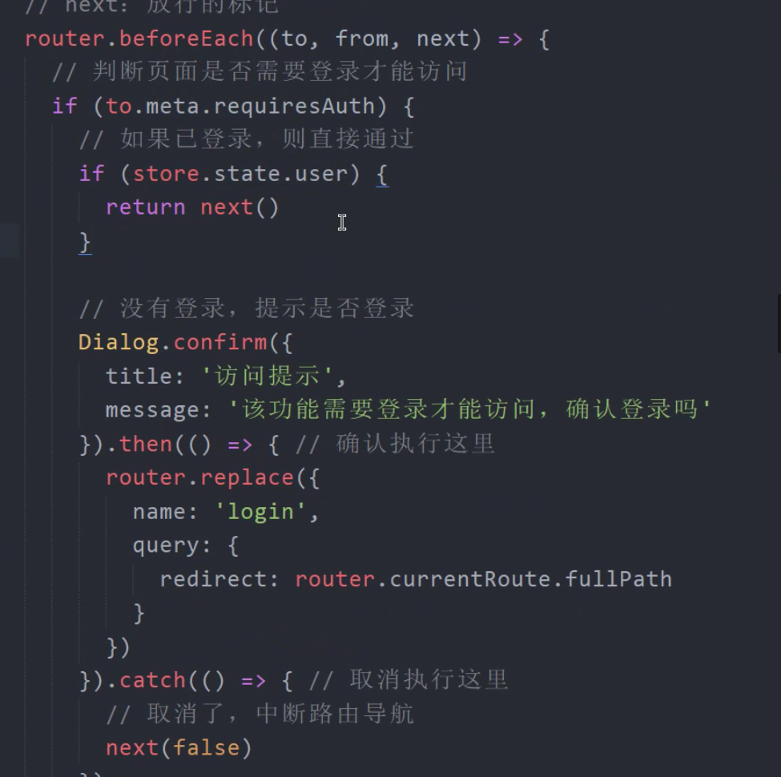

### 1.项目初始化

```javascript
1、安装vue-cli最新版本
如果有旧版本，卸载旧版本 npm uninstall vue-cli -g
暗转新版本 npm install -g @vue/cli

2、安装指定版本 vue-cli
查询可用版本 npm view vue-cli versions --json
安装指定版本 npm install -g vue-cli@2.9.6
npm install -g @vue/cli@版本号 （vue-cli3以上）

3、查看当前版本
vue -V


# 添加远端仓库地址
git remote add origin 你的远程仓库地址

# 推送提交
git push -u origin master

git add 文件
git commit -m "提交日志"
git push

# 如果修改了提交信息，则重新
git push -u 远程仓库 分支信息
```

### 2.lib-flexible插件设置rem基准值

```javascript
npm install amfe-flexible

import 'amfe-flexible'

1px=(1/fontSize)rem
$function px2rem($px){
    @return ($px/$fontSize)
}
```

### 3.postcss-pxtorem实现自动将px转换成rem

```
npm i -D postcss-pxtorem

module.exports = {
  plugins: {
    autoprefixer: {
      //browsers: ['Android >= 4.0', 'iOS >= 8'],
      (写到.browserslistrc里面
      
     > 1%
    #兼容超过百分之一的用户使用的浏览器
    last 2 versions
    #兼容到最后两个版本
    not dead

    Android >= 4.0
    iOS >= 8
    
	)
      
    },
    'postcss-pxtorem': {
      rootValue: 37.5,
      propList: ['*'],
    },
  },
};
```

### 4.nvm命令

```javascript
nvm命令行操作命令
1,nvm nvm list 是查找本电脑上所有的node版本

- nvm list 查看已经安装的版本
- nvm list installed 查看已经安装的版本
- nvm list available 查看网络可以安装的版本

2,nvm install 安装最新版本nvm

3,nvm use <version> ## 切换使用指定的版本node

4,nvm ls 列出所有版本

5,nvm current显示当前版本

6,nvm alias <name> <version> ## 给不同的版本号添加别名

7,nvm unalias <name> ## 删除已定义的别名

8,nvm reinstall-packages <version> ## 在当前版本node环境下，重新全局安装指定版本号的npm包

9,nvm on 打开nodejs控制

10,nvm off 关闭nodejs控制

11,nvm proxy 查看设置与代理

12,nvm node_mirror [url] 设置或者查看setting.txt中的node_mirror，如果不设置的默认是 https://nodejs.org/dist/
　　nvm npm_mirror [url] 设置或者查看setting.txt中的npm_mirror,如果不设置的话默认的是： https://github.com/npm/npm/archive/.

13,nvm uninstall <version> 卸载制定的版本

14,nvm use [version] [arch] 切换制定的node版本和位数

15,nvm root [path] 设置和查看root路径

16,nvm version 查看当前的版本
```

### 5.引入字体图标

### 6. VantUl

```javascript
   <!--  开启路由模式-->
        <van-tabbar v-model="active" route>
            <van-tabbar-item icon="home-o" to="/">资讯</van-tabbar-item>


    插入按钮
    通过 button 插槽可以在输入框尾部插入按钮。
    <van-field
      v-model="sms"
      center
      clearable
      label="短信验证码"
      placeholder="请输入短信验证码"
    >//居然没有结束标签
      <template #button>
        <van-button size="small" type="primary">发送验证码</van-button>
      </template>
    </van-field>
    //结束标签在这`

      <van-button size="mini" round>获取验证码</van-button>

	元素变为块级会width会继承父元素的width
    
    @click.prevent(阻止表单默认事件按钮)

    from有专门校验指定的表单项:

    
//覆盖样式写法    
/*全局样式*/
@import "./icon";

/*   #d43c33   */
.app-nav-bar{
  background-color: #d43c33;
  .van-nav-bar__title{
    color: #fff;
  }
  .van-icon{
    color: #ffffff;
  }
}
    

//图标
神奇的知识点
/deep/.new{
    font-size: 22px;
}


van-cell 不带slot写进去就是默认插槽，放在右边
```

### 7.路由管理+布局配置

### 8.axios

```javascript
/*请求模块*/
import axios from 'axios'
const request=axios.create({
   baseURL:"http://ttapi.research.itcast.cn/app/",

})

// 添加请求拦截器
// 添加响应拦截器

export default request


跨域请求多个接口问题--proxytable的配置保持不变
由于设置了axios.defaults.baseURL，跨域请求时候必须重写这个baseURL
// 获取当前服务器环境下的地址
let mes = window.location;
let _baseurl = `//${mes.hostname}:${mes.port}`;

this.$axios({
    baseURL: _baseurl,   //重写baseURL
    url: 'api/movie/top250', 
})
.then(function (response) {
   console.log(response);
  })
.catch(function (error) {
   console.log(error);
});
axios文档中有说明配置的优先原则
理由猜想（如果上面的方案已经解决了你的问题，下面的可以略过...）
为什么proxytable无效？
其实没有无效，只是他捕获的路径是以当前服务器环境为基础的，比如改vue项目运行在localhost:8000，则proxytable里面捕获的是 http://localhost:8000/api/movie/top250
基于以上，axios跨域失效就能解释了：因为全局设置了baseURL，你的axios请求基础路径就是baseURL,比如说上面那个项目，axios请求的路径会变成baseURL/api/movie/top250,所以proxytable就“失效”啦。
解决思路
就是发起axios请求时候重写baseURL，把他改成当前服务器环境下的地址，这样proxytable就能捕获到了

```

### 9.奇怪的知识点

```
window.history.back() 和 this.$router.back()一样

methods全程async!!!神奇的写法

import store from './../store/index'
export const getCurrentUser=()=>{
  return request({
    method:'get',
    url:'/user/2182',
    headers:{
      Authorization:`${store.state.user.token}`
    }

  })
}

&not:(:last-chird){

}

伪元素less
&:before{

}

flex-shrink:0 不参与平分

splice(index,1)删除index位置的元素

在模板中用$event表示事件参数
@uodate-active=“active=$event”	
```

### 10.登录注册

```javascript
         async onLogin(){
           try{
           const result=await login(this.user)
           console.log(result);
           }catch (err){
             console.log("登录失败",err)
           }
         },         
          
         Tost组件用的时候引入的时候，或者使用this.$tost

		mapState 写的时候不用this
```

### 11.验证码多次点击问题

### 12.token

```javascript
用vuex+Localstorage存储本地

用请求拦截器统一添加token信息来获取接口
import store from './../store/index'
const request=axios.create({
   baseURL:"http://157.122.54.189:9083",

})

// 添加请求拦截器
request.interceptors.request.use(function (config) {
  // 在发送请求之前做些什么
  let user=store.state.user
  //如果已经登录则添加信息
  if (user){
    config.headers.Authorization=`${user.token}`
  }

  return config;
}, function (error) {
  // 对请求错误做些什么
  return Promise.reject(error);
});

```

### 13.深度作用操作符

```javascript
在scoped中可用   /deep/ 或者::v-deep 可以穿透样式而不影响子组件的全局样式 （.vue提供的特殊语法）
```

### 14.VantUI-list组件

```javascript
//固定列表
.article-list{
  position: fixed;
  top: 85px;
  left: 0;
  right: 0;
  bottom: 50px;
  overflow-y:auto;
}


    		  list: [],
              loading: false,
              finished: false,
              isRefresh:false,
              refreshSuccessText:'',
//pullRefresh下拉刷新
     async onPullDownRefresh(){
            let data=await getArticle(
              {category:this.channel.id}
            )
            this.list.unshift(...data.data.data)
            this.isRefresh = false;
            console.log(this.list)
            this.refreshSuccessText=`更新了${data.data.data.length}条数据`
          },
//上拉加载更多
          async onLoad() {
            // 异步更新数据
            let data=await getArticle(
              {category:this.channel.id}
            )
            //把数据放到数组里面
            this.list.push(...data.data.data)
            console.log(this.list)
            // 判断加载状态是否结束，如果不是false则永远停在这
            this.loading = false;

              // 数据全部加载完成，不再加载
              if (this.list.length >= 30) {
                this.finished = true;
              }

          },

              
      
```

### 15.第三方资源404

```javascript
<meta name="referrer" content="no-referrer" />
```

### 16.频道编辑模块

```javascript
popup弹出组件挂在body


      delChannel(index){
            if(index<=this.active){
              this.$emit('switch',this.active-1)
            }
            this.userChannels.splice(index,1)
          },


```

### 17.数据持久化

```javascript

              if(this.user){
                addUserChannels({name:value})
              }else{
                //没登录存到本地
                setLocalStorage('user-channels',this.userChannels)
              }


    async loadChannels(){
      let channels=[]
      if(this.user){
        //登录状态下
        let data=await getUserChannels()
        channels=data.data.data
      }else{
        //注销状态下
        let localChannels=getLocalStorage('user-channels')

          if (localChannels){
            //有本地存储
              channels=localChannels
          }else{
            //没本地存储
            let data=await getUserChannels()
            channels=data.data.data
          }
      }
      this.channels=channels
    }
```

### 18.文章搜索

### 19.watch完整写法-解决组件没渲染时watch监听不到数据的问题

```javascript
      searchText:{
            handler(){
              console.log("!")
            },
            immediate:true
            //该回调会在监听开始后立即调用
          }

import {debounce} from 'lodash'
    searchText:{
             handler:debounce(async function (){
              let data=await searchKeyword(this.searchText)
              this.searchList=data.data.data
            },200),
            immediate:true
            //该回调会在监听开始后立即调用
          }

```

### 20.lodash-JS常用工具包

```javascript
npm install lodash
```

### 21.搜索关键字字符串高亮显示

```javascript
v-html当成html内容来输出
          <div slot="title" v-html="highlight(value.title)"></div>

          highlight(title){
              return title.replace(
                new RegExp(this.searchText,'ig'),
                `<span style="color: #d43c33">${this.searchText}</span>`
              )
          }
        },
```

### 22.数组去重

```javascript
indexOf
filter
findIndex
forEach

```

### 23.porp

```javascript
porp接受的引用类型数据（对象，数组）不能重新赋值，
想赋值的话就让它的父组件赋值吧！！！！！！！！！！

在子组件只能修改porp里对象或数组类型的数据，其他类型的数据不能修改，在data里面新创建一个数据localName=name(prop)
```

### 24.动态路由传参

```javascript
//在组件中获取动态路由参数
1.通过this.$route.params.id
2.通过props

:to="{
          name:'article',
          params:{
          articleId:article.id
  		}

  	{
    path: '/article/:articleId',
    name:'article',
    component:()=>import('./../views/article/index'),
    props:true
  },
      
      //article组件中
       props:{
          articleId:{
            type:Number,
            require:true
          }
        }, 
      
```

### 25.引用地址放在栈，引用类型放在堆

### 26.github-markdown.css

### 27.解决后端返回的大数字问题

### 28.图片预览

```javascript
         handlePerviewImage(){
            //获取文章内容的DOM容器
            let articleContent=this.$refs["article-content"]
            //得到所有的img标签
            //DOM数据更新不是立即的
            let imgs=articleContent.querySelectorAll('img')
            //循环img,给img注册点击事件
            let imgPaths=[]
            imgs.forEach( (img,index)=>{
              imgPaths.push(img.src)
              img.onclick=function (){
                //在事件处理函数中调用函数预览
                ImagePreview({
                  images: imgPaths,
                  startPosition: index,
                }); 
              }
            })
          }
```

### 29.文章评论

```javascript
v-if 销毁避免数据缓存 

v-if处理条件渲染:随着弹出层的关闭而销毁
```

### 30.在组件中使用v-model

```javascript
当你传给子组件的数据既要求又要修改，可以使用v-model给子组件！！！

相当于
默认传递名称为  :value="user.name"!!!  接受名称要写value
默认监听inoput事件 @input="user.name=$event"!!!
本质还是父子组件通信 

缺点就是只能使用一次 

如果有多个数据需要同步绑定，可用.sync修饰符
：gender.sync="user.gender"
相当于
@update:gender="user.gender"  接受名称要写gender
@update:属性名称="user.gender"

一般把最常用的数据设计为v-model
不太常用的数据设计为.sync 
```

### 31.<input type="file" hidden ref=file

```javascript
accept="image/png"  //png格式图片
accept="image/*"

  <input type="file" hidden ref="file" accept="image/*" @change="onFileChange">
      <van-cell is-link title="头像" center @click="$refs.file.click()">
        <van-image
          width="30"
          round
          height="30"
          :src="userProfile.head_img"
        />
              
    onFileChange(){
            this.$refs.file.value=""
            //解决相同文件不触发change事件
          }, 
              
```

### 32.图片预览

```javascript
    onFileChange(){
            //解决相同文件不触发change事件
            const oImg=window.URL.createObjectURL(this.$refs.file.files[0])
            this.img=oImg

            this.isPhotoEditShow=true
            this.$refs.file.value=""
          },
              
       
              
	

      预览image,上传文件对象
```

### 33.搜awesome vue插件/库

### 34.条件缓存组件

```javascript
keep-alive
include - 字符串或正则表达式。只有（名称匹配）的组件会被缓存。
    <keep-alive :include="['layoutIndex']">
缓存的组件名称
```

### 35.控制缓存

```javascript
    <keep-alive :include="cachePages">
      <router-view></router-view>
    </keep-alive>

        computed: {
          ...mapState(['cachePages'])
        },

addCachePage(state,pageName){
          if (!state.cachePages.includes(pageName)){
            state.cachePages.push(pageName)
          }
        },
        removeCachePage(state,pageName){
          let index=state.cachePages.indexOf(pageName)
          if (index!==-1){
            state.cachePages.splice(index,1)
          }
        },

登录前删除缓存 this.$store.commit('removeCachePage','layoutIndex')
登陆后添加缓存


当组件在 <keep-alive> 内被切换，它的 activated 和 deactivated 这两个生命周期钩子函数将会被对应执行。
在 2.2.0 及其更高版本中，activated(){
    //从缓存被激活
} 和 deactivated(){
    组件失去活动了
} 将会在 <keep-alive> 树内的所有嵌套组件中触 发。


//页面返回跳转到上一次滚动的位置

    activated(){
      this.$refs.scrollView.scrollTop=this.scrollTop
    },
    computed: {},
        beforeMount() {},
        mounted() {
            this.$refs.scrollView.onscroll=debounce(()=>{
                  this.scrollTop=this.$refs.scrollView.scrollTop
            },50)
        },
```

### 36.cropperjs(头像裁切)

### 37.prop传参

```javascript
     <van-cell v-for="item in list" :key="item.id" :title="item.title" :to="{
          name:'article',
          params:{
              articleId:item.id+''
          }}"/>


  {
    path: '/article/:articleId',
    name:'article',
    component:()=>import('./../views/article/index'),
    props:true
  },
```

### 38.响应拦截器处理token过期问题 

```javascript
router.replace('/login')
```

### 39.登录返回界面问题

```javascript
  <div class="not-login" v-else>
        <van-icon size="60px" name="https://b.yzcdn.cn/vant/icon-demo-1126.png" />
        <p @click="$router.push({
          name:'login',
          query:{
            redirect:'/'
          }
        })">登录/注册</p>
      </div>


            this.$router.push(this.$route.query.redirect|| '/')
```

### 40.路由守卫处理页面访问权限

```
 meta: { requiresAuth: true }
```



